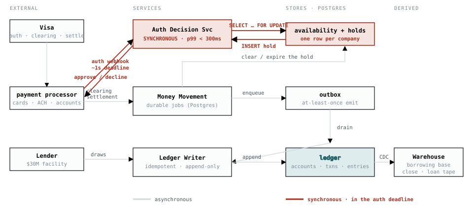
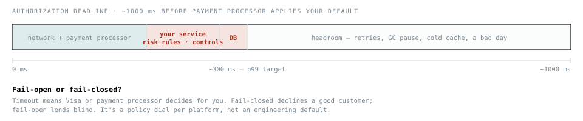
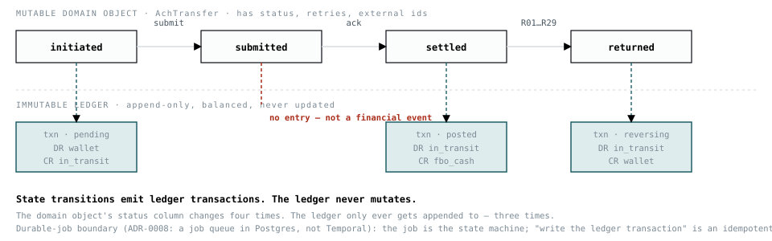

# Documentation

**Read in this order:** [`glossary.md`](./glossary.md) if the vocabulary is new, then
[`vision.md`](./vision.md) for what this is and why, then [`decisions/`](./decisions/) for how every
piece got the shape it has. [`reference-product.md`](./reference-product.md) is the worked example
underneath all of it — one $500 purchase, traced through every account it touches.

| | |
| --- | --- |
| [glossary.md](./glossary.md) | Every term, defined for someone who has never built a ledger. |
| [vision.md](./vision.md) | Why this exists when Formance already does, and what it deliberately does not do. |
| [decisions/](./decisions/) | One file per decision, with the evidence. [decisions/README](./decisions/README.md) is the index and carries what is still open. |
| [reference-product.md](./reference-product.md) | The embedded charge card the ledger is designed against: the chart of accounts, and the lifecycle in text. |
| [roadmap.md](./roadmap.md) | What gets built next, and why in that order. |

## What a ledger is, in one paragraph

A **ledger** answers one question — *who is owed what* — in a way that cannot quietly go wrong. It
does that with **double entry**: every amount is written twice, once as a debit and once as a
credit, and the two sides must sum to zero. The rest is consequences. Entries are never updated or
deleted, because a correction that edits history is indistinguishable from a lie; you post a new,
opposite entry instead. Balances are derived from entries, never the other way round.

This project is that ledger, in Rust and PostgreSQL, with an **embedded B2B charge card** as the
reference product. The card is not a demo — it is what forced the hard parts: authorizations that
reserve money without moving it, clearings that move it, and processor messages that arrive out of
order, twice, or never.

## The three diagrams

These are the only drawings of the system, and they are canonical. They were extracted from an
earlier HTML design board that has since been removed — it had drifted from the decisions in three
major ways and existed mainly to be corrected. Everything it was best at now lives in prose: the
sizing derivation in [0002](./decisions/0002-scaling.md), the authorization latency budget in
[0008](./decisions/0008-authorization-holds.md), and the lifecycle trace in
[reference-product.md](./reference-product.md).

| | |
| --- | --- |
|  | **01 — Architecture.** The authorization decision runs synchronously; the ledger write does not. |
|  | **02 — The authorization hot path.** The ~1s network deadline and the 300 ms p99 budget — see [0008](./decisions/0008-authorization-holds.md). |
|  | **03 — State machines.** Hold, clearing and settlement lifecycles, as decided in [0008](./decisions/0008-authorization-holds.md). |

## Two rules run through everything

- **Correctness is not configurable.** No flag turns an invariant off. *Where* each one is enforced
  is itself a decision — some in the schema, some by construction in the writer — and
  [decisions/README](./decisions/README.md#what-the-schema-enforces-today) keeps the honest
  inventory of which is which today.
- **A claim needs evidence next to it.** Where a document states a number it should be reproducible
  from this tree, and where it is not, the document says so.

## Status

**Design stage.** The service is not built. `schema/schema.sql` exists to show the shape the
decisions describe is expressible in PostgreSQL, and it loads:

```sh
make up       # PostgreSQL 18 in Docker
make schema   # load schema/schema.sql + the seed chart
make test     # cargo test  (covers nothing yet)
```
