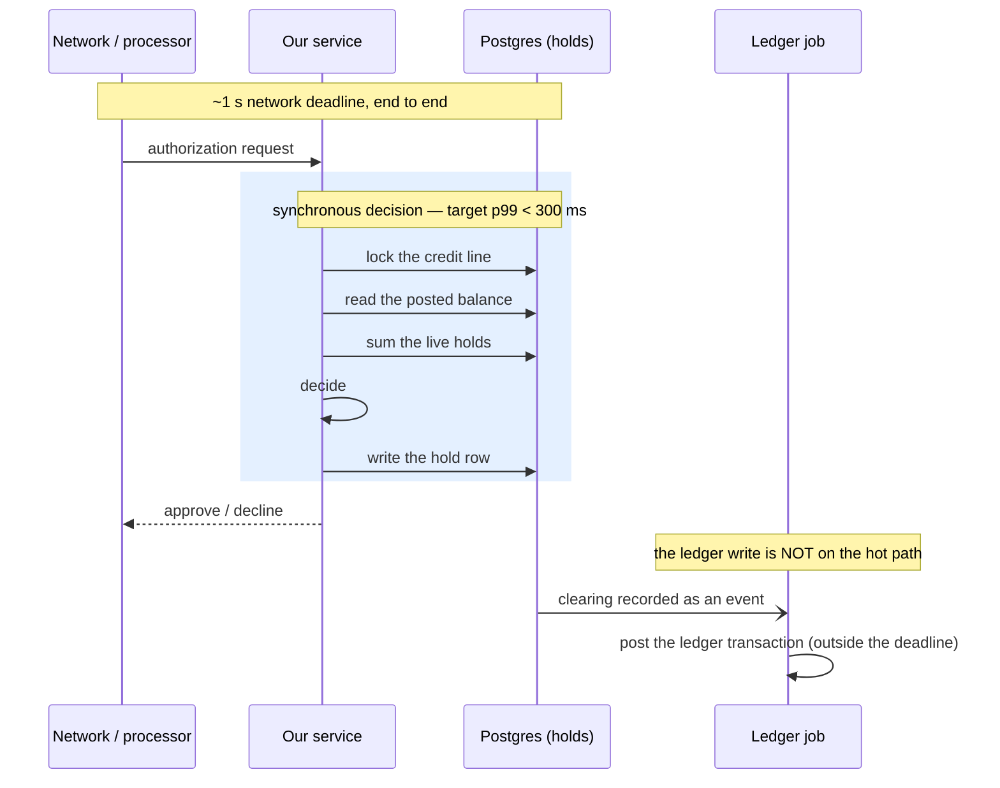
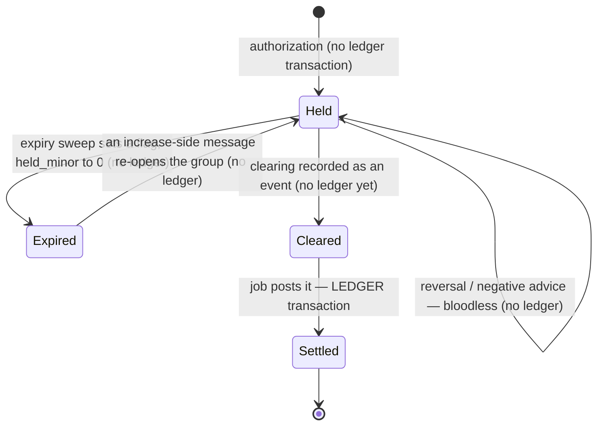

# 0001 — A hold is a SUM over an append-only event log, and its timers live in the same Postgres

**Status:** accepted, and **scoped as future work.** The core ledger ships first; the card rail is
built on top of it afterwards. This ADR records the model and the evidence behind it so the work is
not re-derived — it is *not* a specification of something being built now, and its open defects below
are recorded rather than closed deliberately. Where a sentence here is in the present tense about an
adapter, a writer or a sweep, **that code does not exist**, and neither do the tables: the built
binary (`crates/openledger`) carries the core ledger's `migrate` and `serve` and nothing
card-shaped, and this module's DDL is parked in
[`parked/card/`](/card/parked), applied by no migration.
**Artifact:** the DDL is **parked** — `parked/card/schema.sql`, applied by no migration and loaded
by CI on top of the core ([0008](/decisions/0008-module-boundaries)). The adapter, the
writer and the sweep are **unbuilt**.
**Evidence:** spikes [001](/card/spikes/001-append-only-holds),
[002](/card/spikes/002-processor-hold-semantics),
[003](/card/spikes/003-durable-timers) and [007](/spikes/007-go-or-rust).
Every finding under *Known, and not fixed* is closed by the card rail's
[hold-corrections decision](/card/decisions/0002-hold-corrections), which also deletes the `expiry_reversal` kind
property 3 describes: no processor publishes an event restoring a hold it has already released.

## The decision

An authorization moves no money and writes no ledger entry — nothing is owed when the terminal beeps,
and the purchase may never clear. But the amount is not spendable either, and the next authorization
has about a second to decide if it fits. So a hold is **derived from an immutable log of processor
messages**, never a running amount anyone updates.

**A hold is not a number we keep and edit; it is a total we re-add from an unchangeable list of the
processor's messages.** Card authorizations get corrected, re-sent, and arrive out of order all the
time, and there is no dependable identifier tying a later clearing back to the authorization it
belongs to. A single mutable "amount held" would have to be overwritten on every one of those
corrections — the very number the next authorization decision reads a second later. Storing the raw
messages once and never changing them, then summing them to answer, means any arrival order works and
a correction is just one more appended row, not a risky edit in place.

*The authorization hot path: a roughly one-second network deadline, inside which our own synchronous work targets p99 under 300 ms, with the ledger write deferred to a job outside it.*



**The budget, because it is the only latency-bound path in the system.** The network gives roughly
**one second** end to end; the target for our own synchronous work is **p99 under 300 ms**. What runs
inside it is one short transaction: lock the credit line, read the posted balance, sum the live holds,
decide, write the hold row. **The ledger write is not in it** — a clearing is recorded as an event and
posted by a job outside the deadline ([0002](/decisions/0002-scaling)). Every design choice below that looks
like premature optimization is paying for this number, and **it has never been measured**: spike 007
recorded single-shot wall times of 9.1 ms including connection setup on a laptop-class container,
which is not a p99 and must not be quoted as one. The authorization path needs its own spike.

The vocabulary, since every sentence uses it:

| | |
| --- | --- |
| `card_auth_events` | One row per processor message — authorization, incremental, clearing, reversal, advice, expiry_reversal. Append-only; a correction is a new row. |
| `amount_delta` | The normalised signed amount on that row. **Always a delta**, never a wire value; the adapter converts. |
| `group_key` | Identifies one authorization's family of messages. **Not sent by the processor** — it is our inference about which authorization a clearing belongs to. |
| `card_auth_event_group` | Membership: which event belongs to which `group_key`. System-versioned: `assigned_at` and `superseded_at` are both wall-clock *system* time, not a business axis — the ledger's genuine bitemporal pair is `ledger_transactions (effective_at, recorded_at)` ([0006](/decisions/0006-time-and-as-of)). An assignment is superseded, never updated. |
| `authorized_minor` | Running sum of **increase-side** deltas only. This is what a cumulative restatement restates. |
| `total_minor` | Materialised net sum of every delta in the group — increases minus clearings and reversals. May go negative. |
| `held_minor` | `GREATEST(total_minor, 0)`, and 0 once expired. **The number available credit is computed against.** |
| `total_convention` | `'delta'` or `'total'` — whether this group's increase-side messages carry an increment or a restated cumulative total. Fixed by the first one; mixing is refused. |

| | |
| --- | --- |
| **1. Stored amounts are always deltas** | The adapter converts its processor's convention *at the boundary*, under the group's lock, before the row is written. The derivation is then a plain `SUM` — commutative, and order-tolerant by construction rather than by timestamp — with two qualifications, both under *Known*: a convention mix, and an `expiry_reversal` racing our own sweep. |
| **2. Group membership is a separate system-versioned table** | There is deliberately no `group_key` column on the event. Re-grouping is routine — a clearing arrives unmatched and is attached later, a mis-grouped increment is split out — and storing the inference on the event would force that correction to `UPDATE` a row we call immutable. |
| **3. Expiry is a flag, not an event** | An event carrying `−remaining` would have to read the aggregate to compute its own amount: a read-modify-write smuggled into an append-only log, and a read does not commute. The mirror image is the same mistake and shipped once — an `expiry_reversal` carrying `+remaining` made one 100.00 authorization hold 200.00, still 100.00 after full capture, drift silent because the log genuinely contained the `+10000`; it now carries **zero**, clearing a flag that never subtracted. An expired group re-opens on any increase-side message, including a restatement whose delta is zero, since the restatement itself is the liveness signal; a late clearing does not resurrect it. `expired_authorized` and `expired_total` snapshot the group at release so the alarm can tell *exposure added after a release* from *an event merely arriving after one*. |
| **4. Over-capture clamps to zero and is recorded** | A $1 fuel authorization clearing at $95 must contribute 0 to available credit, never *raise* it. The clamp maps three conditions onto one 0 — legitimate over-capture, an adapter feeding a total into a delta column, a mis-grouped clearing — so `overcaptured_at` and `low_water_minor` make it an alarmable state rather than a value swallowed at `SELECT` time. |
| **5. The per-group total is materialised** | Because the authorization deadline is about a second end to end and summing an unbounded log is unbounded work. *That is an argument, not a measurement*: spike 001 says the derivation "has not been benchmarked here", and the cost of the alternative is unmeasured. **Two views watch it.** `card_auth_unmatched` is the review queue: an event with no live assignment is unmatched *by definition*, so the queue cannot drift from the data it describes. `card_hold_drift` is the alarm, and it has **eight** disjuncts: a materialised total disagreeing with its log (a log with no materialised total is the same disjunct, through the `FULL OUTER JOIN`); a materialised *authorized subtotal* disagreeing with its log; **a group whose declared currency disagrees with one of its own events**; exposure added after expiry; bloodless decreases exceeding increases; a group under water with un-posted decreases; a group mixing conventions; and **a stored `total_convention` disagreeing with its own log**. The two in bold fire under a positive control ([spike 004](/card/spikes/004-hold-corrections) §9). `parked/card/schema.sql` is the implementation — **parked, and applied by no migration**; see [`parked/card/README.md`](/card/parked). |
| **6. The expiry timer is a job row in our own Postgres. No Temporal.** | Durable timers run inside the application binary, backed by the same database the ledger writes to, and the product layer gets a narrow interface whose **transaction parameter is the point**: `at(tx, kind, key, when, payload)` and `cancel(tx, key)` — the crate's method is `remove_job(job_key)` with **no kind**, and job keys are global, so the kind has to be folded into the key. The job row commits in the same transaction as the ledger write, so *"the hold row and its expiry timer both exist, or neither"* is a database guarantee rather than a convention. Exactly one driver ships: **`graphile_worker` 0.13.5** (MIT, on `sqlx` 0.9.0). **The ledger core takes no scheduler dependency at all** ([0002](/decisions/0002-scaling) — every timer belongs to a rail). |

The four properties that matter for the timer, run against a real `ledger_write` table:

```
A. enqueue in tx, ROLLBACK   ledger_write=0  jobs=0        neither row exists
B. enqueue in tx, COMMIT     ledger_write=1  jobs=1        both exist
C. 7-day absolute run_at     run_at=2026-09-02 …
D. idempotent by job key     1 row after 3 enqueues
```

*State machines: the hold, clearing and settlement lifecycles, and which transitions emit a ledger transaction — the ledger-emitting one is marked LEDGER.*



*The lifecycles this decision governs.* Only some transitions emit a ledger transaction — an
authorization emits none.

## Why a SUM over a log

**A clearing has no reliable key back to its authorization.** Network identifiers (ARN, RRN) do not
agree across messages, so grouping is an *inference*, and inferences get corrected. Highnote: *"Do not
rely solely on network reference IDs to correlate authorization and clearing events. Network
identifiers are not guaranteed to be consistent across the lifecycle of a transaction"* — and they
ship an unmatched queue rather than guessing, out-of-order clearing being a routine sequence in their
message table. *(Spike 002 has the URL; re-fetched and matched verbatim.)*

**Processors disagree on delta versus cumulative total, with no norm to fall back on.** Adyen and
Pismo send deltas; **Marqeta** says so unambiguously — *"`authorization.incremental` — Increases the
amount of a previous authorization by adding to it **without replacing it**"*. Lithic, Column and Unit
send restated totals. Treasury Prime releases the old hold and re-holds at the new total, neither — its card *event*
carries the **delta**, and the totals arrive as *separate transaction rows*: two objects, not one
message. And **Stripe, Increase and Galileo each send both in one message** — Galileo puts the
cumulative amount in the primary fields and, in its own words, *"the incremental amount will be
present in the local amount fields"*. Keeping `raw_amount` and `raw_is_total` verbatim beside the
normalised delta is the only defensible response to six conventions with no norm. *(Spike 002 read
thirteen processors' references; six of fifty-one pages carry a link — treat the rest as unverified.)*
And **messages arrive out of order, are re-delivered, and sometimes never arrive** — merchants should
reverse what they do not capture and many do not. Order tolerance is what lets a SUM answer.

**Redelivery is deduplicated at the HTTP layer, in a table of its own.** `webhook_deliveries` keys
`(tenant_id, delivery_id)` on the *processor's* delivery id and has no ledger effect. It is
deliberately not folded into [`ledger_events`](/decisions/0005-event-log-and-write-path): that log's
identity is the operation a caller asked us to accept, and a delivery id identifies one HTTP attempt
at telling us about it. Collapse the two and a retried webhook looks like a business event —
the same message delivered twice becomes two accepted operations, which is the failure the idempotency
contract exists to prevent. It is parked with the rest of this module and read by nothing today.

**Two divergences from the field, both deliberate.** About half the systems surveyed write a durable,
balance-affecting row at authorization time, so *"an authorization writes no ledger entry" is a
product choice, not a domain law* — the unqualified claim is that **an authorization posts nothing to
a balance anyone is owed against.** And **six of the thirteen model expiry as a release event** where
property 3 uses a flag — Pismo and Column document no expiry release at all, TigerBeetle expires as an
engine operation, so this is a minority position, not a solitary one.

## Why the timer is a job row and not a workflow engine

> Every Temporal, Rails and pricing figure in this section is **unverified** — no fetchable source sits next to it. Treat them as the reasoning that was persuasive at the time, not as evidence.

| | |
| --- | --- |
| **The requirement is durable *scheduling*, not workflow *orchestration*** | The reference product needs timers that survive restarts — a hold expires after ~7 days, an ACH return window closes ~2 banking days after funds land, statements close monthly, disputes have deadlines — and the longest chain in the design is two steps (ACH settles → wait → post). Nothing uses Temporal's distinguishing features: workflow-as-code with replay, signals into running workflows, child workflows, or versioning. |
| **The exactly-once guarantee is already ours** | Temporal delivers exactly-once *effects* as at-least-once execution plus idempotent handlers. [0005](/decisions/0005-event-log-and-write-path) already requires every handler to be idempotent — that is what the event log is for. Temporal would be a second implementation of a guarantee the ledger already provides. |
| **Temporal cannot enqueue transactionally, and here that decides it** | `StartWorkflow` is a gRPC call to another service and cannot join our transaction — using it means building an outbox, i.e. building a Postgres queue *and then* putting Temporal behind it. The alternative is one row in the transaction we are already committing, which is properties A and B above. |
| **Long timers are harder under Temporal, not easier** | Its own documentation uses our exact shape — sleep on a timer, then run an activity — as the worked example of what breaks: reordering those commands between deploys makes replay non-deterministic. Every deploy during a 7-day hold window becomes a versioning exercise. A job row is inert JSON handed to whatever code is current. |
| **The footprint is disproportionate to ~0.05 jobs per second** — one expiry timer per authorization against [0002](/decisions/0002-scaling)'s own sizing of **30k–150k transactions per month**, i.e. 0.011–0.057 jobs/s: this project's assumption divided out, not a measurement | Temporal Server is four services (frontend, history, matching, worker) with its own persistence database and migrations, plus a separate visibility store; `numHistoryShards` is fixed at deploy time and changing it requires a cluster rebuild; minor versions must be upgraded sequentially with a schema migration each; RBAC ships **off by default** (four roles behind a `ClaimMapper` and `NewDefaultAuthorizer`, but the default is `noopAuthorizer`) and there is no audit logging — notable for the component driving money-movement timers. Its tested Postgres matrix stops at 16.6; we target 18. And the promise that a small team can drop this into AWS is a claim about *one* managed database. |
| **Precedent** | Rails 8 made Solid Queue — a database-backed queue — its default, moving *away* from Redis, and runs 20M jobs/day for HEY at 37signals. Removing the accessory service was worth more than the specialised backend. |

### The reframe that lowers the bar — and why the scheduler is not correctness-critical

Available credit comes from `card_hold_groups.held_minor`, **not** a timer, so a hold past its
deadline but not yet swept still counts. Every timer here **fails conservatively when late**: a late
expiry under-reports available credit, a late ACH finalization holds a receivable open longer. Nothing
produces a wrong ledger, only a temporarily pessimistic one — the scheduler is an *actuator*, not
correctness-critical. A reconciliation sweep makes a lost job recoverable, not silent:

```sql
SELECT g.tenant_id, g.company_id, g.group_key
FROM card_hold_groups g
WHERE g.expired_at IS NULL AND g.held_minor > 0
  AND EXISTS (
      SELECT 1 FROM card_auth_event_group m
      JOIN card_auth_events e ON e.tenant_id = m.tenant_id AND e.id = m.event_id
      WHERE m.tenant_id = g.tenant_id AND m.group_key = g.group_key
        AND m.superseded_at IS NULL
        AND e.hold_expires_at < now());
```

`ix_auth_events__hold_expiry` earns this. `ix_hold_groups__held` does not — its partial predicate matched **100.0% of 20,733 groups** and the sweep's plan never touches it; it serves the authorization read instead — `(tenant_id, company_id) WHERE held_minor > 0`. The sweep filters
on the partial predicate with no tenant or company equality: the `WHERE` clause is the useful half.

**The sweep matches zero rows until the processor deadline is modelled.** Its predicate reads
`card_auth_events.hold_expires_at`, and nothing writes that column — the column exists, but the ingest
path has no parameter for it, so the predicate is NULL everywhere. Making it live means modelling the
deadline a processor sends. Until that is modelled the recovery does not apply — which matters less
than it sounds (an unswept hold over-reserves) and more than nothing (the sweep was load-bearing in
the argument against a durable scheduler).

## What we considered

| | Why not |
| --- | --- |
| **A mutable `holds` row with a running amount** | The obvious model. It needs a reliable clearing→authorization key that does not exist, and every correction becomes an `UPDATE` to the number the authorization decision reads. |
| **Store both conventions, resolve absolutes by `occurred_at`** | The earlier design. Processor timestamps are second-granularity and unordered, so ties fell through to insertion order: the same facts produced different holds depending on which webhook's TCP connection finished first, and it silently **under-reserved credit**. Order-dependence does not vanish here — it moves to ingest, where a lock can serialise it. That is the trade. |
| **Expiry as an event carrying `−remaining`** | Field-standard, and rejected by property 3: it cannot commute, and the mirror image of the same mistake has already cost us a doubled hold. |
| **Derive a restatement's delta from `total_minor`** | Wrong base — the net total also carries clearings and reversals — and the same three messages then produced four holds across six orderings, with no error and no drift, falsifying the headline claim of this file. Hence `authorized_minor`. |
| **`underway` instead of `graphile_worker`** | **Verified rejection, mechanism restated:** `underway` 0.2.0 pins `sqlx ^0.8.2`. It resolves and *builds* alongside `sqlx` 0.9 — the lock holds both 0.8.6 and 0.9.0 — and fails when a `sqlx` 0.9 transaction crosses its API: `multiple different versions of crate sqlx_postgres in the dependency graph`. The rejection stands; the failure is a type mismatch at the boundary, not a resolution failure. |
| **Temporal Cloud** | Not an option for an open-source project: the plan floor is $100/month against an actual consumption cost here of about $14. An OSS user should not have to buy a SaaS subscription to get hold expiry. *(Unverified — no source.)* |
| **Self-hosted Temporal** | The reasons above. The one thing it would buy — a real multi-month workflow engine — is the bet named below. |
| **A scheduler abstraction with two drivers** | An abstraction with one implementation is a seam; with two speculative ones it is a tax. A Temporal driver is *possible* via an outbox — document it, and let the first user who actually runs Temporal contribute it. |

## What it costs

| | |
| --- | --- |
| **Serialised per group** | Ingest, repair and re-grouping each take the group's lock — contention is per authorization, which is not a hot row. Re-grouping locks the event row first, then both groups in `group_key` order, materialising the destination at its place in that order. |
| **A foreign key takes a lock on your behalf, in an order you did not choose** | The membership insert takes an implicit `FOR KEY SHARE` on the event through `fk_event_group__event`, so a lock-ordering argument counting only the locks written in the function is not an argument. This is the most expensive trap here. Every symptom was a deadlock, and deadlocks abort cleanly: they cost availability, not correctness. An advisory lock over the message key space is **not** the fix — it produced 6 deadlocks in 6 trials where the unmodified code produced 0, because a lock taken before the natural one adds an ordering rather than removing one. |
| **Mixing conventions in one group is irreconcilable** | `{authorization +100.00 as a delta, incremental 120.00 as a total}` yields 120.00 in one arrival order and 220.00 in the other, because a total arriving before the delta it restates carries nothing saying it already includes it. Only refusing the mix can fix it. Within one convention, deltas commute and totals resolve to the maximum seen. An adapter should prefer an explicit total field over inferring the convention — Stripe, Increase and Galileo each send **both** in one message, and Stripe's is the **pre-increment** total, so an adapter reading it as the new cumulative figure under-counts by exactly the increment. |
| **A cumulative total cannot be re-grouped *mid-group*** | Its stored delta is relative to the source group's base at the moment it arrived, and that base is not recoverable. **The blanket refusal is over-broad**: `raw_amount` and `raw_is_total` are kept verbatim on the event precisely so the wire value survives normalisation, so splitting a totals event to a *new, empty* group recovers exactly — `delta = raw_amount − 0`. The refusal should be narrowed to a destination that already has a base. See the first *Known* entry below, which the current rule makes uncorrectable. |
| **The application role cannot take the event lock this ADR requires** | Re-grouping locks the event row first, and `SELECT … FOR UPDATE` on `card_auth_events` needs `UPDATE` privilege — which `openledger_app` is not granted and is explicitly revoked. Verified: `permission denied for table card_auth_events`. Either grant `UPDATE` and lean on the append-only trigger to keep it a lock rather than mutability, or find an ordering that does not need it. Open. |
| **A group row cannot be deleted** | `expired_at`, its snapshots and `low_water_minor` are not in the log, so rebuilding one invents them: an expired group came back live with its post-expiry alarm permanently disarmed. Materialisations may be rewritten; state that is not a materialisation may not be removed. |
| **A group carries one currency, with no default** | Summing minor units across denominations reported 100.00 USD + 50.00 EUR as "held 15000" — the vacuity [0007](/decisions/0007-schema-conventions-and-chart) removed from the accounting equation, sitting where the number *is* available credit. |
| **Three things the model cannot express** | A **single-message transaction** (Lithic's `FINANCIAL_AUTHORIZATION`, Marqeta's `auth_plus_capture`; PIN-debit or ATM volume breaks the model). An **end-of-sequence indicator**, which several processors send and which ends a group without waiting for expiry. And **a hold that differs from the authorized amount** (Stripe holds $100 on a $1 fuel check): there is no independent hold field — `held_minor` is `GREATEST(total_minor, 0)`, and `total_minor` is the *net* of every delta, so it cannot be set apart from what the messages say. Each needs a design decision. |
| **Expiry windows are policy, not protocol** | Our release timer is not the network's clearing deadline — that clock drives dispute eligibility and does not extend on an increment. Visa **Product and Service Rules** ([public PDF](https://usa.visa.com/dam/VCOM/download/about-visa/visa-rules-public.pdf), 18 Apr 2026) §5.7.3.5 Table 5-12 — the section sits in the *Product and Service Rules*, not the *Core Rules*, though both are bound into the one PDF: card-present **5 calendar days**; card-absent **10**, or **30** with the extended-authorization indicator; and with the *estimated* indicator **30** for cruise line, lodging and vehicle rental but **10** for the other estimated categories, from *"the date of a valid Authorization"*; rule **0031022**: *"An Incremental Authorization Request does not extend the processing timeframes in Table 5-12, General Approval Response Validity Timeframes and Table 5-13, Country-Specific Approval Response Validity Timeframe Requirements."* Region-variable, so it is policy input, not a constant to hard-code. |
| **STIP and fuzzy matching are unmodelled** | Stand-in processing produces authorizations we never saw. The schema records *which* method assigned a group (`lifecycle_id`, `rrn`, `fuzzy`, `manual`) and keeps the trail, but the matcher itself is out of scope. |
| **Statement close is a self-rescheduling one-shot job**, not a periodic job | Per-customer timezones make it one anyway. |
| **The job key REPLACES; it does not collapse** | `JobKeyMode` defaults to `Replace`, so a second enqueue under the same key **overwrites the first, including its `run_at`**. Three enqueues left one row — and moved the timer two days. A wrapper shaped like `at(tx, kind, key, when)` re-enqueued with an earlier `when` moves an expiry *earlier*, and `held_minor` is `GENERATED` to 0 the instant `expired_at` is set, so a premature expiry **under-reserves the whole hold**. `UnsafeDedupe` is the mode that behaves as "idempotent". And the duplicate is not collapsed silently: `add_raw_job` returns `revision`, which carries the same signal River's `UniqueSkippedAsDuplicate` does. |
| **What is actually given up is a signal from `cancel`** | `remove_job` returns `Result<(), _>`, discarding the row the SQL function returns, and on a **locked** job it does not delete at all — it clears the key, sets `attempts = max_attempts`, and lets the in-flight job proceed. **A cancel that silently fails expires a hold that should have stayed live.** Any wrapper has to read the returned row and treat "no row" as a failure, not a no-op. |
| **The dispute bet** | Four of the five timers are genuinely one-shot. **Disputes are not** — a real chargeback lifecycle is a multi-month state machine (filed, representment, pre-arbitration, arbitration, ruling) with external events arriving early, late, or never, and human steps between: exactly the shape Temporal exists for. If dispute handling grows into it, migrating means moving live in-flight state across a 120-day window during which both systems are authoritative. We take the bet because a hand-rolled state machine over a `disputes` table with deadline-driven jobs is boring, well-understood, and **auditable** — a reviewer or an actual auditor can read a table and a transition function, where reconstructing a dispute from a Temporal event history is strictly harder — and because the risk is confined to the product layer, which [0002](/decisions/0002-scaling) keeps a plug-in rather than a fork. **The ledger core takes no dependency on any of this**: holds are a product-layer concern built on the core, the core does not know they exist, and it touches a scheduler either way, never. |

> **The concurrency figures below — 6-of-6, 91 under mixed load, 720 permutations — came from the PL/pgSQL implementation and its test suite, both deleted by [0004](/decisions/0004-where-logic-lives). Nothing in this tree reproduces them.** They are kept because the *class* they describe is a design constraint; the counts are not re-checkable.

## Known, and not fixed

**A cumulative-total group cannot be corrected once something is mis-grouped in, and neither watcher
can see it.** A second, genuinely different authorization fuzzy-matched into a `total_convention =
'total'` group gets delta `wire − authorized_minor` — for an equal amount, **zero**. Reproduced:

```
 processor_msg_id |     kind      | wire  | raw_is_total | stored_delta
 msg-1            | authorization | 10000 | t            |        10000
 msg-2            | authorization | 10000 | t            |            0

 TRUE live exposure  20000        REPORTED held_minor  10000
 card_hold_drift: 0 rows          card_auth_unmatched: 0 rows
```

Every watcher is blind, each for its own reason. `card_hold_drift` is silent because the log
**genuinely contains the zero** — the materialisation is faithful to a log that has already lost the
money. The convention disjunct is silent because **there is no convention mix to find**: a totals
message went into a totals group, so `any_total` is true, `any_delta` false, and the stored convention
matches the log. (`any_total`/`any_delta` are `bool_or`, so the `amount_delta <> 0` filter changes
nothing either way — blaming that filter would send a fixer at something whose removal fixes
nothing.) The review queue is silent because the event *has* a live membership, and
re-grouping it out is refused by the rule above. The loss is not $100 — it is the destination's
`authorized_minor` at match time, bounded only by what the group had accumulated. A *smaller* second
authorization computes a negative delta and dies on `ck_auth_events__sign`: **the safe case errors,
the dangerous case is silent.** The narrowing in *What it costs* starts a fix — splitting to a new
empty group is exactly recoverable from `raw_amount`. What is missing is anything that *notices*.

**`held_minor` is order-dependent when an `expiry_reversal` races our own sweep, and the
under-reserving order is the likely one.** An `expiry_reversal` carries a zero delta because expiry
never subtracted. But the expiry flag is set by *our* sweep, on a clock the log cannot order:

```
 group | live_exposure | reported_held
 G-A   |         10000 |         10000    sweep first, then expiry_reversal
 G-B   |         10000 |             0    expiry_reversal first, then sweep
```

An early-arriving reversal is a no-op clearing a flag that is not set, and it leaves nothing behind:
an `expiry_reversal` is deliberately **not** increase-side, so it cannot re-open the group the way a
zero-delta restatement can. The sweep then expires against live exposure and `held_minor` goes to 0.
**How often this happens is unknown, and the earlier claim that it is "the expected case" was
unsupported.** It reasoned from Visa's Table 5-12 window being shorter than our hold — but that table
is the *acquirer's clearing-submission* deadline, which this same ADR insists is a different clock.
Worse, every expiry-time message [spike 002](/card/spikes/002-processor-hold-semantics)
documents is a **release**, not an un-expiry, so nothing here establishes that an `expiry_reversal` is
even a message a processor sends: **the wire event this kind maps to is unidentified.** This
**qualifies property 1**: the `SUM` is commutative, but `held_minor` is that `SUM` gated by a flag set
out-of-band, and property 3's "expiry is a flag" is where the order-dependence enters. The fix is a
design decision — record that a reversal was seen in a form the sweep must consult, or make expiry
itself an event and accept the read-modify-write — and neither is taken here.

Recorded rather than closed, because each needs a design decision rather than a guard:

| | |
| --- | --- |
| **A cumulative restatement that DECREASES is refused, and the refusal is sticky** | `authorized_minor` only rises, so a processor restating a lower subtotal after a partial reversal is refused as out-of-order, and the group can never accept a total below its high-water mark again. Measured: 60.00 held against 90.00 real. Representing a decreasing authorized subtotal is the missing piece. |
| **A refused convention mix leaves an order-dependent number in service** | Only the *second* message is refused; the first is already applied, so the same two messages leave 50.00 or 100.00 held depending on arrival order. If refusing the mix is the answer, the *group* should be quarantined, not the message. |
| **The over-reversal alarm self-heals, so a real under-reservation ends silent** | Drift reports a group whose bloodless decreases — reversals and negative advice, neither of which posts to the ledger — exceed its increases. It fires in the *precursor* state and goes false the instant the next genuine increase is absorbed by the negative residue, because that increase raises the compared quantity by exactly what it swallowed. Measured: two reversals against one authorization, then an ordinary incremental — **100.00 live, 0.00 held, 0.00 posted, drift back to zero rows.** Latching it on `low_water_minor` looks like the fix and is not: a group whose messages arrive decrease-first legitimately dips below any clearing so far. **The log cannot decide the question** — a reversal arriving before its authorization and one that should never have been sent are the same three columns, so deciding needs the reversal-to-authorization linkage this ADR does not model. |
| **The clamp hides state, not just presentation** | `held_minor` clamps the report; nothing clamps `total_minor`. Authorize 100.00, clear 100.00, then a spurious reversal of 100.00 leaves the group at −100.00; a genuine 100.00 incremental nets against that residue and the group reports 0 held against 100.00 of live un-cleared exposure. **Detected, not prevented**: drift's `total_minor < 0 AND bloodless_decreases > 0` disjunct fires when the group goes under water, then self-heals as above. An over-capture on a *clearing* is a different case and is correct — a clearing has posted, so exposure is posted + held. |
| **An emptied group pins its currency forever** | Group rows cannot be deleted, so once every event is moved out the `currency` is permanent, and a later message for that key in another currency is refused and never stored. Reusing one inferred `group_key` across currencies is not a realistic domain event, so this is recorded rather than guarded. |
| **Re-grouping can deadlock against a multi-group adapter transaction** | It sorts its two locks by `group_key`; a single ingest takes its one lock in call order, so a batch touching `ZZZ` then `AAA` takes them backwards — 91 deadlocks under mixed load. An ingest cannot sort a lock it does not know about, so the fix belongs in a batch API that sorts. |

### Recorded by review round 15, not fixed

The core ledger takes priority, so these are written down rather than closed.

| | |
| --- | --- |
| **`overcaptured_at`, `low_water_minor` and `open_events` are read by nothing** | This ADR says the first two "make it an alarmable state rather than a value swallowed at `SELECT` time". No view, constraint or index reads either, so **there is no over-capture alarm** — only a place to put one. `open_events` is fully dead and is mentioned nowhere. The schema comment on the expiry disjunct also names `last_event_seq` as what it keys on; that column appears in no predicate of the view. |
| **This ADR lists five drift disjuncts; the view has eight** | Missing from the prose: the **currency** check and the **stored-convention-disagrees-with-its-log** check. Both fire under a positive control. |
| **Treasury Prime does not send delta and total in one message** | Stated twice here. Its card event carries the **delta**; the totals arrive as *separate transaction rows*. Two objects, not one message. The second description in the same paragraph — that it releases the old hold and re-holds at the new total — is the accurate one. |
| **`underway`'s rejection is right, its mechanism is misstated** | It resolves and builds alongside `sqlx` 0.9 (the lock holds both 0.8.6 and 0.9.0). The quoted error reproduces verbatim only when a `sqlx` 0.9 `&mut PgConnection` crosses its API. "Fails against 0.9.0" should read "fails when a `sqlx` 0.9 transaction is passed to it". |
| **Small ones** | `cancel(tx, kind, key)` — the crate's method is `remove_job(job_key)` with **no kind**, and job keys are global, so the kind has to be folded into the key. Visa §5.7.3.5 sits in the *Product and Service Rules*, not the *Core Rules*. Stripe's "cumulative total" is the **pre-increment** total. The `0.05 jobs per second` figure is sourced nowhere. |

