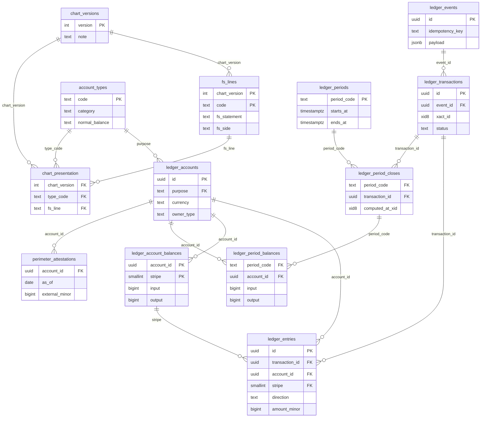
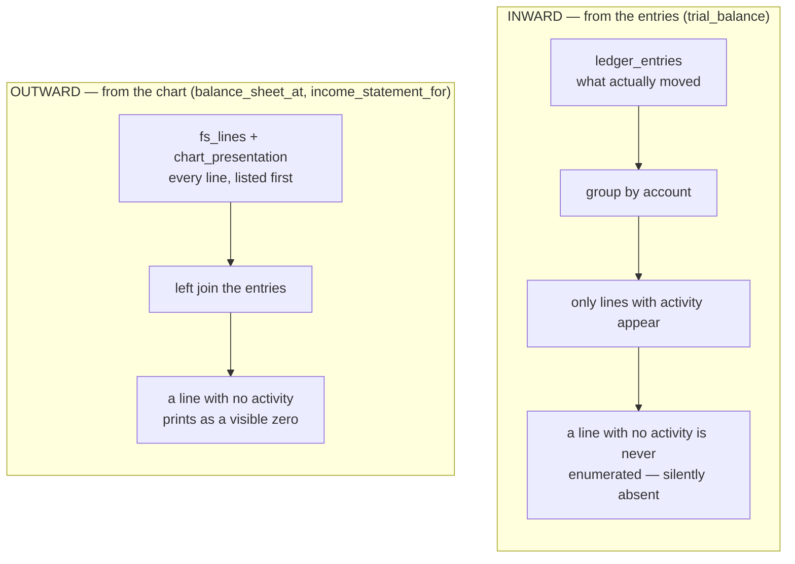
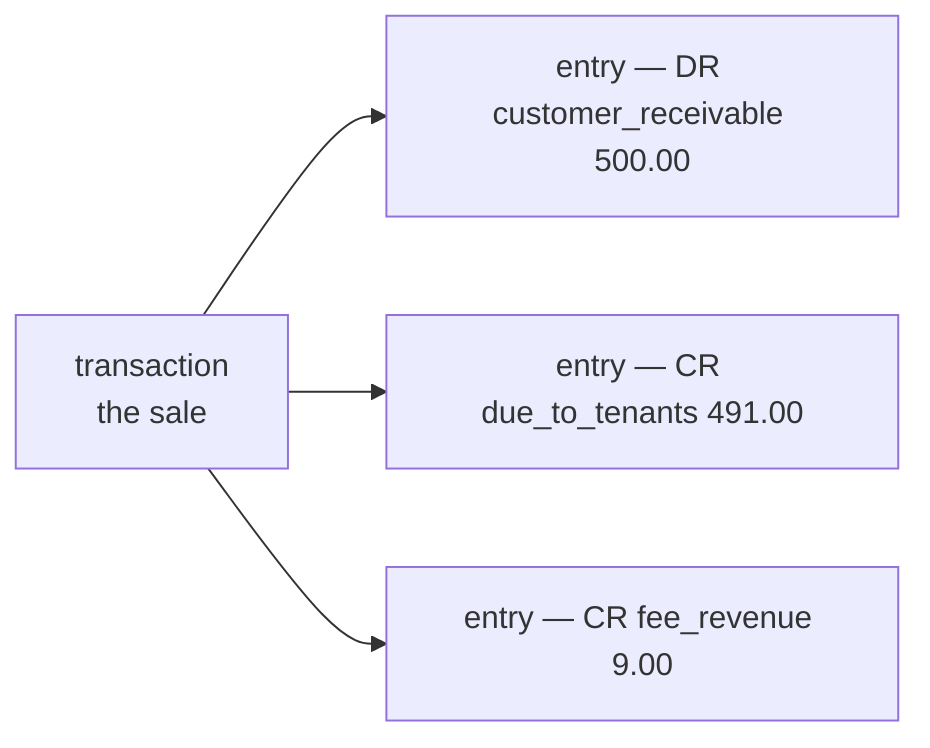
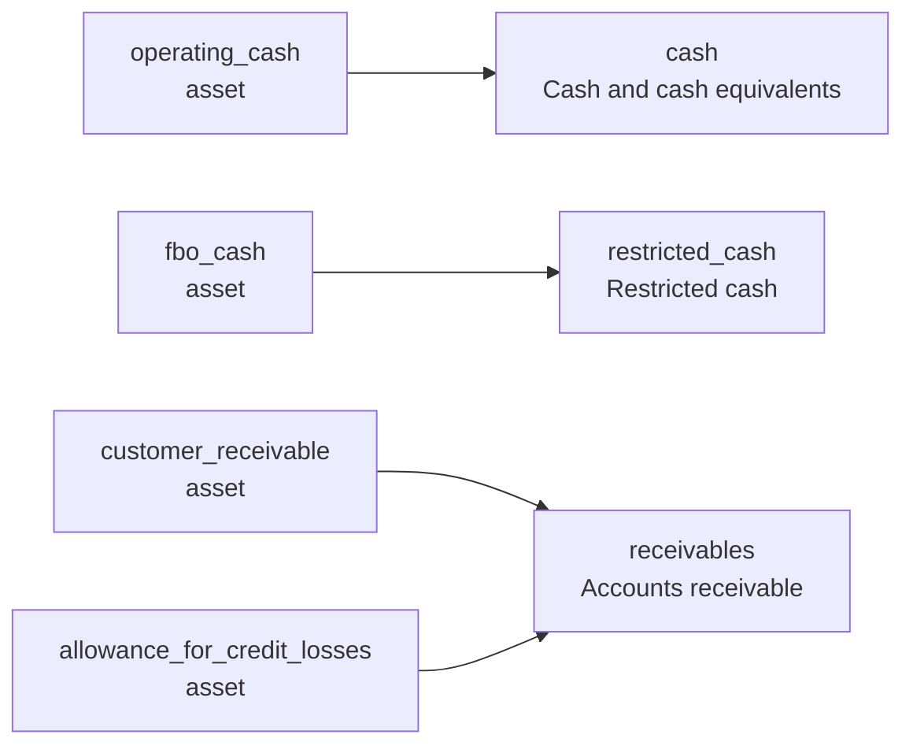

# The database, drawn and explained

## Start here if you have never built a ledger

A ledger answers one question — *who is owed what* — in a way that cannot silently drift. If a word
here is new, the [glossary](/glossary) defines every term this project uses.

**Every movement is written twice.** Once as a **debit**, once as a **credit**, and the two sides
of one transaction sum to the same amount. That is *double-entry*. It is not bureaucracy: it means
an error has to be made twice, consistently, to survive. One $500 sale, with `DR` marking a debit
and `CR` a credit:

```
DR  customer_receivable         500.00    the customer owes us $500
CR  due_to_tenants              491.00    we owe the seller $491
CR  fee_revenue                   9.00    we keep $9 as our fee
    ------------------------------------
    debits 500.00  =  credits 500.00      balanced
```

**Debit and credit are directions, not good and bad.** A debit increases an asset and decreases a
liability; a credit does the reverse. Which direction *increases* a particular account is that
account's **normal balance**, and it is a property of the account rather than something you can
compute. Most assets are debit-normal — but a loss allowance is an asset that grows with credits.
That one exception is why the database stores the normal balance instead of deriving it.

**Balances have to add up in a particular way.** Everything a business owns equals everything it
owes plus what the owners have put in, adjusted by what it has earned and spent:
**assets = liabilities + equity + (revenue − expenses)**. That identity is the *accounting
equation*, and it falls straight out of writing every movement twice.

**Nothing is ever edited.** A correction that rewrites history is indistinguishable from a lie, so
a mistake is fixed by posting a new, opposite entry beside it. Every table that records what
happened is append-only, enforced rather than agreed.

**Balances are derived from entries, never the other way round.** If a stored balance and the
entries behind it ever disagree, the entries are right. Any stored balance is a cache and has to
be able to say so.

**Two dates, always.** When something happened, and when we found out. They differ constantly — a
card clearing carries the network's business date, days before the webhook that told us about it.

Three kinds of note appear throughout. **CAUGHT** is a real defect this design stopped, with what
it cost when it got through — evidence the shape works. **STILL OPEN** is a gap that exists right
now. **A LIMIT** is as good as the approach gets, and not a gap. The unbuilt work the
schema is waiting on is on the [roadmap](/roadmap); every limitation a decision accepted is in that
ADR's own *"What it costs"*.

## The map

Thirteen tables in five layers. **The journal** records what happened, in order. **The register**
says whose money it is — and holds the one cached number the fast path reads. **The chart** says
what any of it means, per version, and it is now a four-table layer of its own
([0012](/decisions/0012-chart-governance)). Two more layers close the set: the **period close**
(`ledger_periods`, `ledger_period_closes`, `ledger_period_balances`,
[0011](/decisions/0011-period-close-and-report-axes)) stores each period's closing balance on the
business-date axis, and a single **perimeter** table
([0012](/decisions/0012-chart-governance)) records what a third party said an account's balance was.
The three period and one perimeter tables, plus the two new chart tables, arrived with the merge of
[0009](/decisions/0009-append-only-perimeter)–[0013](/decisions/0013-write-path-contract). Arrows
point from a table to the table it depends on.

The diagram below is all thirteen tables and the foreign keys between them — the versioned chart is
`chart_presentation` sitting between `chart_versions` and the two tables it maps, `account_types`
(what an account means) and `fs_lines` (where it shows):



Every relationship is a *composite* key — it carries more than an id. **When a value is copied into a
second table for speed, the copy is made part of a key, so it cannot disagree with the original.**
Three report readers (not drawn) — `trial_balance`, still a view, and `balance_sheet_at` and
`income_statement_for`, now set-returning functions — read the chart at the bottom and the journal
at the top.

A **tenant** is one customer of this ledger — one business whose books are kept separately inside
a shared database. **PK** marks the columns that identify a row uniquely.

## Four ideas that explain the schema

These four decide most of the column choices below.

### 1 · The tenant leads every key

*Free now, extremely expensive later.*

Every ledger table starts with `tenant_id`, every ledger table's primary key **begins** with it,
and every index and foreign key on those tables carries the prefix. It costs nothing today and it
is the prerequisite for row-level security, for partitioning, and for ever splitting across
database instances — all painful to retrofit and trivial to design in.

It also makes one correctness property *expressible*. Because the foreign key from an entry to its
transaction includes the tenant, a transaction spanning two tenants is structurally impossible
rather than merely discouraged. That matters because each tenant's books have to balance on their
own: a movement between tenants is modelled as two transactions joined by clearing accounts, never
one transaction that leaves one side short.

The chart tables deliberately *lack* the prefix — they are deployment-global. So per-tenant charts
are not representable and a tenant cannot add an account type without a migration. A real
limitation, recorded rather than glossed
([ADR-0007](/decisions/0007-schema-conventions-and-chart)).

### 2 · Reports are built from the chart outward

*Because balanced books do not mean correct reports.*

Drop a single account from a report and the accounting equation catches it — the two sides differ
by exactly that account's balance. But drop a whole *balanced* slice — one tenant, one currency, a
date range containing only whole transactions — and the equation still holds perfectly while
revenue is understated. That is the failure a filter bug actually produces, and no amount of
balance-checking can see it.

So completeness is treated as a separate invariant from balance, and the fix is structural:

Two ways to build a report — from the entries, where a line with no activity is never enumerated
and is silently absent; and from the chart, where every line is listed first and a line with no
activity prints as zero:



`balance_sheet_at` and `income_statement_for` enumerate outward. `trial_balance` still enumerates
inward, and is the wrong thing to build a completeness claim on — it is kept for a different job:
showing what actually moved.

### 3 · Two time axes, two mechanisms — never one

*The single most common way a correct ledger produces a wrong number.*

An entry recorded today with a business date of last week is *backdated*, and it is completely
normal: late clearings and chargebacks arrive that way. Which means the order entries were
*recorded* in is not the order they *happened* in.

Here is what that costs. Suppose each entry stored the account's balance immediately after it — a
*running balance*, which is what most ledgers do and what this one used to do:

| account_seq | effective (business date) | amount | running balance |
| --- | --- | --- | --- |
| 1 | Jan 10 | +100 | 100 |
| 2 | Jan 30 | +50 | 150 |
| 3 | Jan 20 — **backdated** | +30 | **180** |

Ask for the balance *as of Jan 25* by reading the latest running balance and you get **180**. The
truth is **130**. The Jan 20 entry has a higher sequence number than Jan 30's, so the newest running
balance already includes January 30 — it was computed before anyone knew about Jan 20.

**This schema stores no running balance at all**, and that is the reason. Repairing one means
rewriting every later row on every backdated insert, and refusing to repair it means keeping a
number that is only right about the order rows were inserted in — an order nobody asks questions
about. [Spike 009](/spikes/009-where-the-balance-lives) has the prior art, including Fragment's own
sentence on why they store no such column: computing historical balances on write *"leads to
cascading updates when posting a backdated Ledger Entry."*

So there are two mechanisms and each read names its axis. "What is this balance now" is a
primary-key read of the one row in `ledger_account_balances` that holds it. "What was it as of a
business date" aggregates over `effective_at`,
which is linear in history — and the accountants' answer to that is a **period close**, which
stores each period's closing balance so the query becomes *prior close plus entries since*. Those
close tables (`ledger_periods`, `ledger_period_closes`, `ledger_period_balances`) are applied in the
baseline; the writer that computes a close is not yet built.

The tempting alternative — a second running balance on the business-date axis — is the one thing
this design refuses outright, because a backdated insert then has to rewrite every later row for
that account. Measured on Formance, the closest comparable open-source ledger: 114 ms for a
thousand entries inserted in order, **84 seconds** for the same thousand backdated. A running
balance on a mutable axis is a trap ([ADR-0006](/decisions/0006-time-and-as-of) has the
numbers).

### 4 · Two triggers, and a written case for each

*The default is none.*

Business logic in the database is a road other ledgers have walked and reversed — Formance built a
full stored-procedure write engine and then spent two migrations demolishing it, dropping five
triggers and twenty-seven functions. So the rule here is that a trigger must state, in the schema
beside it, the invariant it holds, why nothing declarative holds it, and *what it does not protect
against*. Two clear that bar ([ADR-0004](/decisions/0004-where-logic-lives)):

- **The journal is append-only.** No row in `ledger_entries`, `ledger_transactions` or
  `ledger_events` may be updated or deleted. There is no `CHECK` for "this row may not change" and
  no key that expresses it. The only non-trigger option is to withhold the privilege — and
  revoking a privilege binds the application's database user only, while migrations, repair
  scripts and a human at a database prompt all run as the owner, which is exactly the population
  that historically does the damage.
- **And `TRUNCATE` is not a `DELETE`.** PostgreSQL fires no delete trigger for it, so the guard
  above sees nothing. It needs its own trigger per table — a single database-wide event trigger
  would be the natural one object for the job, and PostgreSQL refuses that for `TRUNCATE`
  outright.

**The actual objects: two functions, and one `UPDATE`/`DELETE` guard plus one `TRUNCATE` guard on
each of the nine append-only logs — eighteen triggers in all.** The journal trio is the worked
example below; the same pair now guards the chart's history (`chart_versions`, `fs_lines`,
`chart_presentation`), the perimeter attestations and the period record too, and
[the census](#what-the-schema-enforces-today) lists every one. Measured on a fresh load, not
asserted:

| function | trigger | on | fires on |
| --- | --- | --- | --- |
| `refuse_mutation()` | `ck_entries__append_only` | `ledger_entries` | `UPDATE`, `DELETE` |
| | `ck_txn__append_only` | `ledger_transactions` | `UPDATE`, `DELETE` |
| | `ck_events__append_only` | `ledger_events` | `UPDATE`, `DELETE` |
| `refuse_truncate()` | `ck_entries__no_truncate` | `ledger_entries` | `TRUNCATE` |
| | `ck_txn__no_truncate` | `ledger_transactions` | `TRUNCATE` |
| | `ck_events__no_truncate` | `ledger_events` | `TRUNCATE` |

Each one raises and aborts the statement; there is nothing in them beyond refusing. Six objects for
the trio rather than two because `TRUNCATE` needs a separate trigger from `UPDATE`/`DELETE`, and
every table needs its own — `TRUNCATE a CASCADE` reaching `b` is refused by **b's** guard, naming b,
so a test that only checks "something was refused" still passes with a's guard deleted.

All of them are `ENABLE ALWAYS`, so they fire even on the replication apply path and under a restore that
disables triggers. A replica that does not enforce its publisher's invariants is a laundering channel for
corrupt rows.

> **What they do not protect against.** An owner who disables or drops a trigger, which is one
> statement. Nobody in this field holds append-only with a database mechanism: the two published
> answers are Monzo's reviewed service allowlist, which took their ledger from callable-by-1,500
> to callable-by-six, and Uber's cryptographic signatures over each record. Both live outside the
> database. This is the cheap 80%, and it binds accidents rather than intent.

## A transaction, and an entry

A **transaction** is the event. An **entry** is one leg of it. The $500 sale above is *one*
transaction and *three* entries:



They hold different kinds of fact. The transaction knows *when* — both dates — what it resolves or
reverses, and which event caused it. Each entry knows *where*: one account, one direction, one
amount, and its place in that account's sequence (`account_seq`) — no running balance among them.

The split is not bookkeeping neatness. **Balance is a property of the group, not the line**: a
single entry is money appearing from nowhere, and "debits equal credits" cannot be checked against
it. It also decides what a correction is — a whole new transaction pointing at the old one, never
an edit to a leg.

## The thirteen tables

In the order the diagram reads: the journal, then the register and the chart, then the period close
and the perimeter.

### `ledger_entries` — one leg of one movement

The row everything else exists to protect. An entry is one side of one movement: this account, this
direction, this amount, this currency. The $500 purchase above is three entry rows. They are never
updated and never deleted.

> **CAUGHT — without the effective-date key.** A transaction dated 2026-06-15 accepted a thousand
> entries dated 1999-01-01. Every business-date report in the system reads that column.

**The direction carries the sign, never the amount.** `amount_minor` is always positive, and it is
an integer of *minor units* — cents, not dollars, and never a floating-point number, which cannot
represent 0.10 exactly. Storing a negative amount *and* a direction gives you two ways to say the
same thing, and eventually they disagree.

**Why `currency` is here at all, when the account already has one.** It is redundant: an account
holds exactly one currency, so `account_id` already determines it. The copy exists so a
business-date or per-currency aggregate is a single-table scan instead of a join — and it is safe
only because it is not trusted. It sits *inside* the foreign key
`(tenant_id, account_id, currency)`, whose target index `uq_accounts__id_currency` exists for no
other purpose. The copy cannot disagree with the original, because a row where it disagrees cannot
be written.

**Two columns are copied here on purpose.** `effective_at` is copied from the transaction so a
business-date report is a single-table index scan rather than a join, and `currency` is copied from
the account. Both copies sit inside composite foreign keys, so neither can drift from its source —
that is what makes the copying safe rather than merely fast.

`account_seq` is a per-account counter that orders one account's history. It is what an as-of
reconstruction walks, and its **gaplessness** is what makes "no entry is missing" a claim you can
check: numbers 1 through N with nothing skipped.

Each journal row also carries `xact_id` — an `xid8` defaulted to `pg_current_xact_id()` — that
stamps it with commit order. That is the axis a report pins to: `report_cursor()` hands back one
`xid8`, `balance_sheet_at` and `income_statement_for` take it and return it as `pinned_cursor`, and
`ix_entries__asof_commit (tenant_id, account_id, xact_id)` is the index that serves the read, so a
report sees a single consistent cursor rather than a moving target.

**Not a Postgres sequence**, and the difference is the point: a sequence counts per *table*, not per
account, and `nextval()` is not rolled back — an aborted transaction leaves a permanent hole in the
numbering, which destroys exactly the property the column exists for. So the writer issues it inside
the same statement that updates the balance ([ADR-0004](/decisions/0004-where-logic-lives)).

The keys that carry a rule: `uq_entries__account_seq` (one row per account per sequence number —
arguably the journal's most important key); `fk_entries__account` on `(tenant, account, currency)`,
so an entry cannot carry a currency its account does not hold; `fk_entries__txn_effective`, so the
copied business date must equal the transaction's; and `ck_entries__amount_positive`.

### `ledger_transactions` — the unit of atomicity

A transaction groups the entries that must be true together, and carries both dates:
`effective_at` from whatever actually happened, `recorded_at` from when we heard about it.

**Its status never mutates.** A `pending` transaction that later settles does not become `posted` —
a *new* row is written pointing back at it through `resolves_id`. A reversal is the same shape
through `reverses_id`. Both are unique, so nothing can be resolved twice or reversed twice, and a
transaction may do one or the other but not both.

This is why the table can be append-only at all. The usual design updates a status column in place,
and then the answer to "what did this look like last Tuesday" is gone.

The keys that carry a rule: `uq_txn__one_resolution` and `uq_txn__one_reversal` (once each — because
we refuse to mutate, the usual `UPDATE … WHERE resolved_at IS NULL` guard is not available here);
`ck_txn__not_both` and `ck_txn__no_self_reference` beside them; `uq_txn__one_per_event`, below; and
`uq_txn__id_effective`, which adds no uniqueness the primary key did not already give. `(tenant_id,
id)` is `pk_txn`; the third column is there so a composite foreign key can carry the business date
along with the id, which is what makes the copy on the entry unable to drift. **Drop it and the
schema does not load** — `there is no unique constraint matching given keys`. A guard whose absence
is a build failure rather than a test failure needs no test.

> **CAUGHT — `uq_txn__one_per_event`.** Without it, two transactions were produced from one event
> row, so the idempotency spine did not by itself prevent double-posting.

> **CLOSED — `event_id` is `NOT NULL`** ([0013](/decisions/0013-write-path-contract) §3). "Every
> transaction references the event that caused it" is an invariant now, and it landed while the
> journal was empty — the only time it is free: with one event-less row committed, `SET NOT NULL`
> is refused and the `DELETE` that would fix it is refused by `refuse_mutation()`, so the routes
> left are `DISABLE TRIGGER` or fabricating history. The dashed arrow is solid.

### `ledger_events` — every accepted operation, including the ones that move no money

External systems retry. A webhook arrives twice; a client resends after a timeout. Something has to
make the second attempt harmless, and it cannot be a key on the transactions table — because
**most of what a ledger accepts writes no transaction at all**.

An account being opened writes none. Neither does a limit change, a rejected posting, or a
metadata edit. Put the retry key on the transaction and every one of those operations has nowhere
to live
([ADR-0005](/decisions/0005-event-log-and-write-path)).

**The retry contract:** same idempotency key and the same request body → replay the stored outcome.
Same key, *different* body → refuse. Silently returning the wrong stored result is worse than
failing.

`payload` is deliberately complete enough to *replay* from, not merely to audit — a rebuild after a
bug, or an export to another deployment, both need that, and it is far cheaper to honour in the
first migration than to retrofit.

> **DECIDED, WRITER-SIDE — the replay contract is two statements**
> ([0013](/decisions/0013-write-path-contract) §2): `INSERT … ON CONFLICT DO NOTHING RETURNING`,
> then — when the insert returned nothing — a *separate* `SELECT` returning
> `(event_id, transaction_id, body_matches)`, refusing loudly on a hash mismatch. Two traps are
> measured rather than assumed: the elegant one-statement CTE form returns **zero rows** under
> exactly the race it exists to handle, and the claim itself fails with `40001` under
> `REPEATABLE READ`, so the replay path cannot exist at a stricter isolation level. The writer that
> runs these statements is now built — `crates/ledger/postgres/src/repository.rs`, orchestrated by
> `ledger::LedgerService` ([the service](/service)); without it the unique index alone only makes
> the second attempt fail.

### `ledger_accounts` — whose money, in what currency

One row per (owner, purpose, currency). A company's receivable in USD is one account; the same
company's receivable in EUR is another. Currency is part of an account's identity, not a label on
it.

An account also has an **owner type**: a company, the platform, a bank account, or *house* — the
operator's own accounts, which have no owner id. Two partial unique indexes keep those two worlds
disjoint, because a plain unique index would not constrain house rows at all: their `owner_id` is
`NULL`, and in SQL one null never equals another.

**House accounts are per tenant**, not per deployment. A single global house account makes every
tenant contend on one row, and it makes a tenant's books incomplete on their own
([ADR-0002](/decisions/0002-scaling)).

The account carries a copy of its type's `category` and `normal_balance`, so a report never has to
join the chart just to learn the sign of a number — and that copy is a foreign key into the row it
was copied from.

The keys that carry a rule: `uq_accounts__owned` and `uq_accounts__house`, the two partial indexes
that keep the owned and house worlds disjoint; and `uq_accounts__id_currency`, which — like
`uq_txn__id_effective` on the transactions table — is a referenced-side index rather than a new rule.
`(tenant_id, id)` is already the primary key; this one carries `currency` alongside it so
`fk_entries__account` has something to point at. It is unbuildable-if-missing for the same reason,
and untested for the same reason.

> **CAUGHT — without the currency in the key.** USD entries sat happily inside EUR accounts and the
> declared currency was decorative.

### `account_types` — the chart of accounts, as data

A *type* is a kind of account: `customer_receivable`, `fbo_cash` (money held *for benefit of* a
customer), `interchange_revenue`. Each declares its category — asset, liability, equity, revenue or
expense — and its normal balance. It does *not* carry the statement line it rolls up to: that
presentation lives in `chart_presentation`, keyed by chart version (below), so a reclassification is
a new chart version rather than an edit here.

**The chart lives in a table because every business needs a different one.** A card programme has a
`platform_rev_share_payable`; a marketplace wallet does not. It also has to *store* each type's
normal balance rather than compute it, because some accounts break the pattern — a loss allowance
is an asset that grows with credits — and code that derives the balance from the category gets
those wrong.

In `chart_presentation`, where that mapping actually lives, `fs_statement` and `fs_side` are
**generated columns** — derived by the database from the category and never supplied — and they sit
inside the composite foreign key `(chart_version, fs_line, fs_statement, fs_side)` into `fs_lines`.
That turns "a revenue type may not report under an expense caption" from a trigger into a key.

> **CAUGHT — two silent failures, by the same key.** Pointing a revenue type at a cost-of-revenue
> line put 6,000.00 of revenue on the expense side of the income statement — with net income still
> correct, so every aggregate check stayed green. And a rebate typed expense-with-a-credit-balance
> inflated revenue directly: the same signature, in the opposite direction.

### `fs_lines` — the lines of the balance sheet and income statement

One row per line of a financial statement — the rows a reader actually sees.

**Why this is not just `category`.** A category is a *side* of the statement, and there are only
five of them. A balance sheet has more lines than that: "Cash and cash equivalents", "Restricted
cash", "Accounts receivable" and "Other assets" are all assets. So `chart_presentation` names, per
chart version, the line each account type appears on, and the mapping is many-to-one in both
directions:



*Two assets, two lines — same category, deliberately different lines. Two types, one line — the
allowance nets against the receivable.*

Splitting the first pair is a money question, not a taxonomy one. `fbo_cash` is customer money held
*for benefit of* the customer; `operating_cash` is the operator's own bank balance. Put them on one
line and unrestricted liquidity is overstated **by the entire customer float** — the number a lender
and a covenant both read.

Because the presentation names a line for every account type, a report can be built by enumerating
from the chart outward, which is idea 2 above.

`side` is declared, not inferred: derived from whatever has been posted, a line with no activity
evaluates to null and quietly lands on the wrong half of the balance sheet.

> **CAUGHT — `ck_fs_lines__side_matches_statement`.** A balance-sheet line carrying an
> income-statement side was counted on *neither* side and vanished: 90% of a balance sheet missing,
> reporting balanced.

> **A LIMIT, NOT A GAP — captions are constrained and still not trusted.** Two lines sharing a
> caption are indistinguishable to a reader, so a unique index trims and lowercases before
> comparing. It is *not* a guarantee: one Cyrillic `ѕ` in place of a Latin `s` passes every check,
> prints identically, and misreports earnings. Unicode look-alikes are unbounded, so consumers key
> on the *code*, and the balance sheet emits it for exactly that reason.

### `chart_versions` — the chart as an append-only history

A chart version is a snapshot of the whole presentation: created, never edited, never deleted. There
is no stored "current version" and no singleton row to update — `max(version)` *is* the current
chart (the view `chart_version_current`), so "current" cannot disagree with what exists. Each version
carries a `note`, `NOT NULL` and non-empty, because IAS 1.41 requires the *reason* for a
reclassification to be disclosed and that is the half a schema can hold.

The point of versioning is that a reclassification is a **new version, never an edit** — which is
what lets an issued statement name the version it was presented under and stay reproducible. A
version whose content could change would identify nothing.

### `chart_presentation` — which line a type reports under, per version

This is where `fs_line` now lives. `account_types` carries a type's *identity* — its category and
normal balance — and says nothing about where it prints. `chart_presentation` names, per
`(chart_version, type_code)`, the `fs_line` that type rolls up to. Identity is unversioned;
presentation is versioned, because IAS 1.41 requires presentation to change (with comparatives moving
alongside) while identity may not change under posted history ([ADR-0012](/decisions/0012-chart-governance)).

**A report resolves an account's line by looking up `chart_presentation` at a chosen
`chart_version`.** Pass the current version and you get today's chart; pass the version an old
statement was issued under and it still shows its old line, because the mapping it read is still a
row, not something an edit overwrote. That is the whole reason `fs_line` was moved out of
`account_types`: it used to live there unversioned, so a reclassification silently restated every
statement ever issued.

The integrity is two composite foreign keys — one into `account_types` carrying `category` and
`counterparty_scope`, one into `fs_lines` carrying the generated `fs_statement` and `fs_side` — which
is what turns "a revenue type may not report under an expense caption" into a key rather than a
trigger. The two CAUGHT defects under `account_types` above are the ones that key stops.

### `ledger_account_balances` — the row a writer locks

One row per (account, currency, `stripe`), holding total money in, total money out, and the last
sequence number issued. It is the only table in the schema that is *supposed* to be updated, and it
is rebuildable from the journal at any time. A **stripe** is a shard of a hot account's balance row
(ADR-0013): to spread lock contention the balance is stored as N physical rows, a reader SUMs them,
and an unstriped account holds exactly stripe 0 — so the primary key is `(tenant_id, account_id,
currency, stripe)` and each stripe is a separate lock.

**The obvious objection first: why store a balance at all, when you can add up the entries?** You
can, and it stays correct forever — that is what makes this table a *cache* and not the truth. But
summing is linear in the account's history, and the accounts a business asks about most are the ones
with the most entries. That is the read-side argument, and on its own it would be worth arguing
about.

**The write side is not arguable.** To append an entry you need the account's next sequence number,
and there is nowhere to take it from. `SELECT max(account_seq) … FOR UPDATE` over the journal locks
an append-only table, and — the part that actually breaks — **cannot lock a row that does not exist
yet**, so the first two entries for a brand-new account race and both get sequence 1. The upsert
below has no such gap: `INSERT … ON CONFLICT DO UPDATE` *is* the insert-and-lock, and it works
identically whether or not the row already exists.

**So its real job is serialization.** A single statement adds this posting's amounts and returns both
the new balance and the next sequence number — so the row lock *is* the serialization point. No
`SELECT max()`, no advisory lock, no retry loop, and no gap for two concurrent writers to race
through:

```sql
INSERT INTO ledger_account_balances AS b (tenant_id, account_id, currency, stripe, input, output, last_seq)
VALUES (…)
ON CONFLICT (tenant_id, account_id, currency, stripe) DO UPDATE
   SET input    = b.input  + excluded.input,
       output   = b.output + excluded.output,
       last_seq = b.last_seq + 1
RETURNING b.last_seq, b.input - b.output;
```

**And why a separate table, rather than two columns on `ledger_accounts`?** Because you would be
locking the wrong row. A balance changes on every posting; account identity almost never. Folding
them together means every posting updates a wide row carrying JSON and several indexes, where a
narrow row is cheap to lock and stays in memory — and "cheap to lock" is the most
performance-critical property in this schema
([ADR-0007](/decisions/0007-schema-conventions-and-chart)). Keeping `input` and `output` apart
rather than as one signed number keeps the update commutative and makes gross turnover free.

**Could there be a better lock?** [Spike 003](/spikes/003-throughput-ceiling) tried lock-free append
and concluded *"the contention was always the thing worth removing; the lock never was"* — a
sequence leaves holes, an advisory lock adds a second lock manager and still needs a `max()` read,
and optimistic retry storms worst on the hot account, which is precisely the contended case.

So this row is a lock and a counter that also caches. Worth knowing that `account_seq`'s gaplessness
is enforced when the number is *issued* and checked nowhere afterwards
([ADR-0004](/decisions/0004-where-logic-lives)).

> **This table needs a scheduled `VACUUM`, and autovacuum will not provide one.** Measured: 800,000
> updates to a single row produced **zero autovacuums**, because the trigger is
> `50 + 0.2 × n_live_tup` over the *whole* table and HOT pruning keeps the dead-tuple count
> oscillating far below it. The table grew **8.9 MB per 100,000 updates**, linearly and without
> bound, because pruning frees space inside a page without telling the free-space map. Read latency
> is unaffected — the cost is disk. One plain `VACUUM` fixes it completely, and after one, a further
> 400,000 updates added zero pages. Either cron it or set `autovacuum_vacuum_scale_factor = 0` on
> this table with a small absolute threshold, so the trigger stops scaling with the account count.
> ([Spike 009](/spikes/009-where-the-balance-lives) has the run.)

> **CLOSED — two copies, and `recon_balance_breaks` compares them.** The sum of the entries and this row are
> two answers to the same question. For a long time no view compared them and no constraint related
> them: the cache was moved from 1,000.00 to 100.00 with `last_seq` forged, and every report stayed
> green. There
> used to be a *third* copy — a running balance on each entry — and
> [spike 009](/spikes/009-where-the-balance-lives) dropped it, which improves this rather than
> worsening it: the third number was computed *from* this row in the same transaction, so it agreed
> with the cache even when the cache was wrong. Recomputing from the append-only entries is the
> first comparison that can actually fail — **and it now ships**:
> [ADR-0010](/decisions/0010-reconciliation) designed the comparison as `recon_balance_breaks`, in
> six classes so the row's three jobs fail visibly apart, and it is applied in the baseline. The
> forged-cache reproduction above is now one row in that view.

> **DECIDED — the cache means posted; entry-level reads that count `pending` are the *available* question.** One posted 100.00
> and one pending 500.00, measured on this schema in one instant:
>
> | read | answer |
> | --- | --- |
> | this cache row (`input - output`) | **600.00** |
> | recompute from `ledger_entries` | **600.00** |
> | recompute joined to `status = 'posted'` | 100.00 |
> | `trial_balance`, `balance_sheet_at` | 100.00 |
>
> **This is not a cache defect**, which is what an earlier version of this paragraph called it. The
> cache and the naive recompute agree exactly — and so did the running balance, before it was
> dropped. The split is between *entry-level* reads and *status-aware* ones, because
> `ledger_transactions.status` lives one join away and no entry-level read consults it. Only the
> status-aware aggregate matches the statements, and it is the 4–14× more expensive query.
>
> [Roadmap question 2](/roadmap#the-cache-means-posted)
> is answered: **the cache means POSTED** ([ADR-0010](/decisions/0010-reconciliation)). The writer
> accumulates `input`/`output` for posted transactions only, while `last_seq` advances on every
> entry — a pending entry still needs its `account_seq` issued under the same lock. TigerBeetle
> reached the same split by separating `debits_pending` from `debits_posted`; this schema keeps one
> pair of posted columns and *derives* "available" as posted plus the pending population, which
> `recon_pending_bridge` enumerates and ages. The 600.00 row above describes the pre-decision
> behaviour and is what the bridge now makes visible instead of implicit.

> **CLOSED — a hard deployment constraint, now owned and issued**
> ([0013](/decisions/0013-write-path-contract) §1). This works under PostgreSQL's default `READ
> COMMITTED` isolation. Raise the level and, under contention, the same statement fails with
> *could not serialize access* — measured: 64–82% of writes lost at 8 writers, and an
> in-transaction retry rescued **0 of 25,074** failures, because the snapshot does not move. So the
> writer issues `BEGIN ISOLATION LEVEL READ COMMITTED` explicitly, which overrides a stricter
> deployment default.

### The period-close tables — a checkpoint on the business-date axis

Idea 3 named the accountants' answer to "what was the balance as of a business date": a **period
close**, which stores each period's closing balance so the query becomes *prior close plus entries
since* rather than a walk of all history. Three tables hold it, and the close itself is an ordinary
posting — nothing here computes it, these tables only record it:

- `ledger_periods` — a resolved, half-open `[starts_at, ends_at)` boundary in absolute instants, with
  the source timezone recorded as provenance. IANA rules are legislation and change, so a stored
  (local date, zone) pair is not a stable instant; the instants are resolved once, at creation. A
  tenant's periods may not overlap, enforced declaratively by an exclusion constraint — the one
  reason the `btree_gist` extension is required ([ADR-0011](/decisions/0011-period-close-and-report-axes)).
- `ledger_period_closes` — names the transaction that closed a period and the commit cursor the
  checkpoint was computed at. The transaction is typed `period_close` and pinned inside the period by
  composite keys, so a close cannot quietly name a revenue transaction and erase it from the income
  statement.
- `ledger_period_balances` — the effective-axis checkpoint itself: one row per account per period,
  exactly recomputable from `ledger_entries` and reconciled by `recon_checkpoint_breaks`. It is a
  bounded, rebuildable cache on the axis people actually query — not the per-entry running balance
  [spike 009](/spikes/009-where-the-balance-lives) deleted.

The tables are applied in the baseline; the writer that computes a close is not yet built.

### `perimeter_attestations` — what a third party said

Some account types are marked `is_perimeter`: they mirror exactly one *external* balance and must
reconcile against it. That is a claim about the world, not about the row, so no `CHECK` can falsify
it — only data about the world can. This table stores that data: what a bank, a network or a trustee
said an account's balance was, on their statement date. The statement date is a business date with
its timezone stored and resolved once to an instant (ADR-0011), so `perimeter_drift` compares a fixed
instant rather than a session-resolved bare date. Like the journal, it is append-only.

## What the schema enforces today

Measured against a fresh load of `migrations/00001_baseline.sql`, not asserted.

**13 tables · 15 views · 35 indexes · 25 foreign keys · 44 CHECKs · 1 exclusion constraint · 20 triggers over 3 functions · 3 event triggers over 1 function · 5 report functions · 27 policies · 3 roles**

Counted 2026-08-27 on a fresh `psql -f` load. One extension, `btree_gist`
([0011](/decisions/0011-period-close-and-report-axes)), installs its own operator-support functions
into `public` — the "5 report functions" figure counts only ours (`report_cursor`,
`trial_balance_at`, `income_statement_for`, `balance_sheet_at`, `recon_equation_breaks`), filtered
by extension dependency.

Those are the objects **the migration defines**. A database that has actually been migrated carries
one more of each: `sqlx` creates its own `_sqlx_migrations` bookkeeping table, with a primary key —
so `psql -f` gives 13 tables and 35 indexes, and `openledger migrate` gives 14 and 36. That extra
table is also the single object in a migrated database whose name does not match convention 1
(`_sqlx_migrations_pkey`), and it is not ours to rename. Stated because the difference between
"loaded the file" and "ran the migrator" is now a real fork, and a census that does not say which
one it counted is the kind of number this section exists to stop.

Every index and every named constraint matches `^(pk|uq|ix|ck|fk|ex|rls)_`; **0** carry a PostgreSQL
default name. The card module's 4 tables, 2 views and 10 indexes are **parked** and applied by
nothing — [`parked/card/`](/card/parked), loaded by CI on top of the core on every push
([0008](/decisions/0008-module-boundaries)).

One convention that used to live only in a spike is now stated by the schema itself:
**`ledger_account_balances.input` accumulates DEBIT legs and `output` CREDIT legs**, so
`input - output` is the debit-positive arithmetic value of ADR-0007 rule 15 — and under the other
reading every credit-normal account would report drift on its first entry, which is what makes the
stated mapping falsifiable ([0010](/decisions/0010-reconciliation)).

**The schema documents itself.** Every table and every load-bearing column carries a `COMMENT ON` in
the catalog — distilled from the migration's inline comments, each citing the ADR that holds the
rationale — and so do the report functions and the reconciliation views. So `\d+ ledger_entries`,
`obj_description('ledger_entries'::regclass)` or a read of `information_schema` explains the schema to
a human or an AI *without the repo*: that `ledger_entries` is the append-only journal, that `stripe`
is a physical partition a reader sums, that `xact_id < :cursor` is the as-of filter. The
schema-snapshot test dumps `pg_description`, so a comment that drifts from the schema shows in the
diff like any other change ([0007](/decisions/0007-schema-conventions-and-chart)).

**Enforced by the database:**

- Single-row `CHECK`s — `amount_minor > 0`, ISO currency, house accounts having no owner, caption
  cleanliness, statement/side agreement. *(The sign rule per authorization kind is real, and lives in
  the parked card DDL, so nothing enforces it today.)*
- **Chart integrity, by two composite foreign keys.** An account cannot claim a category or normal
  balance its type does not have; a type cannot report under a statement line that contradicts its
  category. A wrong chart is refused at seed time — verified, three of four mutant charts died on
  load.
- **Append-only on the nine immutable logs** — the journal trio (`ledger_entries`,
  `ledger_transactions`, `ledger_events`), the chart's history (`chart_versions`, `fs_lines`,
  `chart_presentation`), the attestation log, and the period record (`ledger_periods`,
  `ledger_period_closes`) — by trigger, `ENABLE ALWAYS`, so it holds on the replication apply path
  too. `TRUNCATE` refused on the same nine. **And the DDL channel is guarded**: three event
  triggers refuse a table rewrite, a drop and an inheritance child on any of them
  ([0009](/decisions/0009-append-only-perimeter)).
- Uniqueness — `uq_events__idempotency`, `uq_txn__one_per_event` (one transaction per event),
  `uq_accounts__house` (one house account per tenant, purpose and currency), and **`uq_entries__account_seq`**, the
  journal's per-account sequence, which is arguably its most important key.
- Three more single-row rules worth naming because they are easy to miss: `ck_balances__non_negative`
  on the cache, `ck_txn__no_self_reference`, and `ck_txn__not_both` (a transaction may resolve or
  reverse, not both).

## What the database deliberately does not enforce

Two invariants live in the **write path** rather than in the schema, and that is a decision rather
than a gap.

**Debits equal credits.** The primitive a caller can reach for is a *posting* — a source account, a
destination, an amount — so a single leg is not expressible. A type is remembered by the compiler
for every caller, forever, with no coordination; a `CHECK` has to be remembered by the next handler.
That is what every comparable system relies on: Formance's `Postings.Validate()` contains no balance
check at all, because there is nothing left to check
([ADR-0005](/decisions/0005-event-log-and-write-path)).

**`recorded_at` and `account_seq` are issued, never accepted.** The writer has no
parameter for a caller to supply them, which is stronger than a database default — a default is
overridable, and *a column with a default is not a constraint*
([ADR-0004](/decisions/0004-where-logic-lives)).

Everything else the schema does not hold is a gap rather than a design, and each one has a
counterexample that reaches it. They are inventoried, with those counterexamples, in each ADR's *"What it costs"*, and the unbuilt
work they imply is on the [roadmap](/roadmap).
