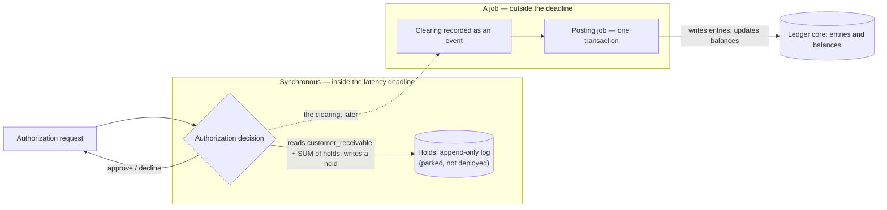

# 0002 — One Postgres, striped: the hot account is the ceiling

**Status:** accepted
**Evidence:** [spike 003](/spikes/003-throughput-ceiling).

## The decision

**This is a general ledger with a card product as its reference implementation, not a card ledger** —
and it stays on one PostgreSQL instance, treating the hot account rather than the hardware as the
thing that runs out.

**The thing that runs out first is a single row, not the server.** Nearly every transaction touches
a few shared accounts — settlement, fee revenue — and writers to the same row have to queue one
behind another. A bigger machine or a second datastore does not clear that queue, because the
contention is on the row, not the hardware. So the fix is to split one hot account into several
physical rows and let writers spread across them — and we sized the real load first, which confirmed
that one ordinary Postgres has room to spare.

The core is accounts, transactions, entries, balances, the two time axes and the event log. Cards,
spend controls and credit lines are built *on* it; a marketplace wallet simply does not install them.
**The core ships first and the card rail comes after it** — [the card rail's authorization-holds decision](/card/decisions/0001-authorization-holds) is
scoped as future work on that basis. That line is what decides what is configurable: the product
layer is meant to be replaceable, the core is not.

Four things follow from the scaling half:

1. **Hot-account striping is a first-class feature.** An account declares a stripe count; writes pick
   a stripe; reads `SUM`.
2. **House accounts are per tenant.** `uq_accounts__house` is `(tenant_id, purpose, currency) WHERE
   owner_type = 'house'` — a modelling fix and a prerequisite for tenant isolation, **not** a
   throughput mechanism.
3. **Say which lever applies where.** Give a writer its own stripe. **The stripe is keyed on the
   writer, never on a business key.**

   > **Corrected in place, 2026-09-01, by
   > [ADR-0018](/decisions/0018-batching-and-stripe-selection) — both halves of this rule were
   > wrong.** It read: *"Batching and randomly chosen stripes cancel each other — worse together than
   > either alone, because random selection scatters a batch and defeats coalescing. Give a writer
   > its own stripe, or key the stripe on the tenant."*
   >
   > **The cancellation does not reproduce.** On the shipped writer, striping under batching is still
   > worth **1.42×**, and choosing the stripe *after* the coalesce rather than per member is worth
   > **+7.6%** — a real effect and a small one, not "worse together than either alone". Spike 003
   > measured the cancellation on a bench schema driven by a per-leg posting function
   > ([spike 018](/spikes/018-batching-and-stripe-selection) §B).
   >
   > **"Or key the stripe on the tenant" is refuted.** A business key relocates the hot spot wherever
   > that key is skewed, and payment volume is always skewed: under a tenant generating 90% of
   > traffic, the worker key delivers **2.8× what the tenant key does** on the identical workload —
   > 1,897 against 677 clearings/s. It is this ADR's own whale finding (the one that collapsed
   > per-tenant house accounts to 1.07×, four paragraphs down) applied one level lower, and this rule
   > walked into it. The "or" is deleted; **the writer key is the only one.**
   >
   > **What replaces the cancellation warning** is an overlap rule: batching trades *lock count* for
   > *lock hold time*, so it pays only when batch members share accounts — measured 2–2.8× *slower*
   > across 32 uniform tenants, and 1.24× faster under a dominant tenant where members coalesce.
   >
   > *(ADR-0018 spends a whole section on this ADR's **scheduler** sentence, which it did not
   > contradict, and for a day said nothing about this rule, which it did.)*
4. **Publish no throughput number until it is measured on RDS.** A round trip costs ~0.05 ms on
   localhost and ~0.5 ms on managed Postgres, which changes the *ranking* of the levers, not just
   their size.

**What a stripe is — and what it never touches.** Striping splits one logical account into N physical
balance rows, so N writers take N different row locks instead of all queueing behind one. That is its
whole job: it shards the *write lock* and the per-stripe sequence counter, nothing else. **A stripe
is never the unit a balance is read or decided against** — every read `SUM`s the stripes, so a
balance, and any check on it, always sees the true account total. So "what if a debit is bigger than
one stripe's balance?" is a non-question: the write lands on that shard, its net simply moves — a
stripe has no floor of its own, since `ck_balances__non_negative` guards the debit and credit
*counters*, not the net — and the account's real balance is the sum. The ledger enforces no
sufficiency or overdraft rule anywhere, deliberately ([the vision](/vision)); a card authorization's
"enough funds?" decision is the rail's job ([the card rail's authorization-holds decision](/card/decisions/0001-authorization-holds)), a
`SUM` over the hold log against the customer's balance read as one summed number. The rule that
follows: **stripe the hot *house* accounts** — settlement, fee revenue — whose balance gates nothing;
a balance-gated account can be striped too, but its gated read then costs O(stripes). Correctness is
never at risk, only read cost.

**How an account gets striped: in place, and without moving anything.** When an account turns into a
hot spot, an operator just raises its `stripe_count`. There is no new account — the `ledger_accounts`
row and its id never change — and no data migration: the existing history stays on stripe 0, and the
new stripes fill lazily as ordinary writes land on them, the first writer to pick a new stripe
creating its row with the upsert it was going to run anyway
([0013](/decisions/0013-write-path-contract)). The balance is the `SUM` over whatever stripe rows
exist, so it stays correct at every instant of the transition. Because that read sums the rows that
exist rather than `0..stripe_count`, you can stripe *down* as safely as up — lowering the count only
stops new writes from spreading, it never strands a stripe's balance. `stripe_count` is an
operator's write-side tuning knob, not part of the account's frozen identity.

### The operator story, corrected 2026-09-01 — `stripe_count` alone is not the striping knob

**"An operator just raises its `stripe_count`" is now misleading on its own, and this is the one
surprise [ADR-0018](/decisions/0018-batching-and-stripe-selection) hands an operator.** Everything
above stays true — no DDL, no backfill, no id change, correct at every instant — but the sentence
implies the column is the knob, and it is not the *binding* one.

**The stripe a write picks is the index of the dispatcher that runs it.** The serving process holds a
fixed pool of writer tasks (`batching::DISPATCHERS`, **32**), each with a stable index for its
lifetime, and the statement selects `index mod stripe_count`. So:

- **A pool of N reaches at most N stripes**, however many an account declares. Measured at 64
  declared and **32 reached** ([spike 018](/spikes/018-batching-and-stripe-selection) §A). Raising
  `stripe_count` past the pool depth is **inert** — the extra stripes are simply never selected.
- **The two numbers are tuned together or not at all.** Raising `stripe_count` from 8 to 64 on a
  default deployment changes nothing; raising the pool is what widens the spread, and a pool of 8
  measures **3.42×** against a pool of 32's **4.31×** on the same account.
- **Lowering the pool has a second effect the column does not**: it also lowers how many concurrent
  *batched* statements can pile onto one account's rows above the unbatched ceiling. ADR-0018 takes
  32 as the default deliberately, because a shallow pool pays its striping penalty on every posting
  forever while a deep pool pays only at ~39× this deployment's derived peak.
- **And the occupied count is lower still than the reachable one.** A dispatcher drains everything
  queued, so a burst is absorbed by a handful of dispatchers — and a dispatcher is a stripe. In the
  committed end-to-end books, 32 declared stripes are reached by **3 to 6**, with up to 25 of 40
  postings landing on one (ADR-0018's cost list has the counts). Striping spreads *sustained*
  contention; it does not spread a burst that one drain can swallow.

**A serving process now holds 38 database connections, up from 8** — `db::POOL_CONNECTIONS`, which is
`DISPATCHERS + 6` and asserted against the pool depth at compile time so the two cannot drift. A
dispatcher without a connection is worse than no dispatcher: it forms its batch and then blocks in
`begin` while the members it meant to coalesce keep arriving. The six above the pool are what keep
the startup schema gate — and any future reader — from waiting behind a pool of writers that is full
by design.

**So size the database for it.** PostgreSQL's default `max_connections` is 100. Two serving replicas
plus a migration job is ~80 connections before anything else connects, and three replicas exceeds the
default outright. Count `38 × replicas`, add the migrator, the sweep and whatever else holds a
session, and raise `max_connections` or put a pooler in front — the same class of setting as the
`shm_size: 1gb` [ADR-0010](/decisions/0010-reconciliation) documents for the sweep's parallel plan,
and it fails the same way: fine on one node, an incident at three.

## The evidence

A $30M facility divided by a ~35-day receivable turn is **$100–300M/yr of card spend** at full
utilization. At a $150–400 average B2B ticket that is 30k–150k transactions per month — **under 1 TPS
average, and maybe 20–50 TPS at a Monday-morning peak**. One Postgres instance handles that on a
laptop; throughput was never the constraint, which is why it is sized before it is designed.

The real constraints are correctness (every cent, no manual fixes), auditability (reproduce any
number as of any date, forever), **one latency-bound path** (the authorization decision — see
[the card rail's authorization-holds decision](/card/decisions/0001-authorization-holds)), and product surface area (one engine serving several
products without forking). *Anyone who opens by sharding the ledger has misread the problem.* Every
multiple quoted below is against this figure, so the derivation is the number that matters.

Spike 003, durable settings, stock Postgres, one 16-core machine:

| Configuration | clearings/s |
| --- | --- |
| baseline (one shared account row, no batching) | ~800 |
| + coalesced batching | 3,420 |
| + **striping** 64 ways **and** single-call posting, *instead of* batching | **7,897** (2 GB table; 7,816 at 43 MB) |

- **The baseline is already 16–40× the volume the reference product needs**, untuned — that is
  ~800/s against the 20–50 TPS peak derived above, and it is the only multiplier in this repository
  you can check without leaving the page.
- **The bottleneck is one row, not the machine.** A single *customer* account costs 12%; the shared
  **hot account** — settlement, fee revenue, the one nearly every transaction touches — is the whole
  ceiling, plateauing at four concurrent writers and then *declining*. pgledger's published numbers
  agree: **10,636.8 transfers/s across 50 accounts against 7,558.9 across 10**, same worker count.
- **Striping works however load is distributed** — *when its key is the writer.* 872 → 6,970
  clearings/s with one tenant; 948 → 7,405 with 32 tenants where one generates 90% of traffic.
  ([Spike 018](/spikes/018-batching-and-stripe-selection) supplies the qualifier: keyed on the
  *tenant*, striping under a whale reproduces this section's own 1.07× collapse one level lower —
  the writer key beats it 2.8× on the identical workload. See rule 3's correction above.)
- **Per-tenant accounts are not the mechanism.** A uniform benchmark shows 9.1× from splitting per
  tenant; with a dominant tenant — what real payment volume looks like — it collapses to **1.07×**,
  because that tenant's own house accounts become the new hot row. Splitting *relocates* the
  bottleneck; striping removes it. Per-tenant accounts stay anyway, for the data model, per-tenant
  reconciliation, and as the prerequisite for RLS.

**Three layers, and only the middle one owns a scheduler.**

| layer | what it is | needs a scheduler? | writes the ledger? |
| --- | --- | --- | --- |
| **1. Ledger core** | accounts, transactions, entries, balances, event log | **no** | it *is* the ledger |
| **2. Rails** | card, ACH, wallet — each with its own state machine and deadlines | yes ([the card rail's authorization-holds decision](/card/decisions/0001-authorization-holds)) | yes, on the events it decides are financial |
| **3. Product** | authorization decisions, spend controls, credit lines | no | **no** |

The authorization decision runs synchronously against a store of holds, while the ledger write
happens on a job outside that deadline:

The holds store is [`parked/card/`](/card/parked)'s DDL, applied by no migration — **it is not
deployed**. And a hold is a `SUM` over an append-only log, never an amount anyone updates: an earlier
version of this diagram drew a single mutable *"one row per hold group"*, fed by `SELECT … FOR
UPDATE` and `INSERT hold`, which [the card rail's authorization-holds decision](/card/decisions/0001-authorization-holds)
went on to **reject**. What the split gets right is this section's point — the decision is
synchronous, the ledger write is not.

**The core needs no scheduler, ever** — every timer belongs to a rail. And a clearing is recorded as
an event and posted by a job *in one transaction*, outside the authorization deadline, so the
**outbox and the job queue are one component, not two**.

**The authorization path writes no ledger entry** — only the hold tables
([the card rail's authorization-holds decision](/card/decisions/0001-authorization-holds)) — and **reads one number**, the `customer_receivable`
balance. That single read is the product layer's entire coupling to the core, which is what makes the
product a plug-in rather than a fork. **Keep the interface exactly that narrow; it is the seam to
protect in M1.**

**That is true of the code and was false of the schema**, and [0008](/decisions/0008-module-boundaries)
closes the gap. Measured: not one foreign key crosses the card/core boundary in either direction, and
a Cargo-feature build with the card crate out of the graph **compiles clean against a database that
has never seen the card DDL**. The schema half is now true as well, though **not** by the route 0008 gave: rather
than moving into a `card` schema, the card DDL was lifted out of the baseline entirely and parked in
[`parked/card/`](/card/parked), applied by no migration. A wallet-only user gets seven
core tables and nothing else. What is still missing is what 0008 wanted and parking does not give —
**removability**: there is no `DROP SCHEMA card CASCADE` to run, because there is nothing installed
to drop. See [0008](/decisions/0008-module-boundaries).

## What we considered

| | Why not |
| --- | --- |
| **Stay a card ledger** | Same engine either way. Forking one ledger per product is the cost this avoids, and the card rail's entire coupling to the core is one read. |
| **Shard by tenant** | Only if you outgrow one instance — treasury accounts cannot be split, so shards would span them. |
| **A second datastore for the hot path** | Adds a consistency boundary to remove a bottleneck that striping removes without one. |
| **TigerBeetle** | Excellent, and still wrong here — below. |

## Why not TigerBeetle

Three reasons, none of them that it is bad — and it deserves a straight answer, because the fit is
real: its two-phase transfer maps onto card authorization almost exactly. A pending transfer with a
timeout *is* a hold with an expiry, posting it for less *is* a partial clearing, voiding it *is* a
reversal.

It still loses, on grounds unrelated to the ledger core. It solves a throughput problem **we measured
ourselves not to have**. Its fixed schema — no ad-hoc queries, joins or aggregation — leaves reporting,
statements, multi-tenancy and RLS on Postgres anyway, so it *adds* a datastore and a consistency
boundary rather than replacing one. And [TigerBeetle Cloud](https://tigerbeetle.com/cloud) exists on
AWS/Azure/GCP, but with no AWS-*native* service, self-hosting means operating a six-replica NVMe
cluster. **Take from it anyway:** its two-phase transfer with timeout is a better-factored hold than
ours. **Revisit if** a user sustains thousands of clearings/s after striping.

## What it costs

- **A stripe is a row in `ledger_account_balances`, not a second account.** One logical account is N
  physical balance rows, so `uq_accounts__house` — which refuses two house accounts of one purpose —
  is orthogonal, and N stripes of one account coexist under it
  ([0013](/decisions/0013-write-path-contract)). Measured at 7.7–9.2× over three runs on the baseline
  plus the stripe column.
- **The ceiling is global** — shared by every tenant on a database, not granted to each.
- **Cross-tenant transactions exist and must be modelled.** `operating_cash` mirrors *one* real bank
  account and the facility is one line from one lender, so neither splits per tenant: **7 of the
  reference trace's 24 transactions touch `operating_cash`**, none of them clearings. Clearings are
  tenant-local; treasury is not. Splitting the book in two, joined by intercompany due-from/due-to
  accounts, restores locality — and `recon_scope_breaks` ([0010](/decisions/0010-reconciliation)) now
  reconciles the two sides, summing the mirror pair **per counterparty** so a third scope cannot cancel a real gap.
- **The striped balance read grows with the stripe count**, the authorization path's one read
  included. See [0006](/decisions/0006-time-and-as-of) for the as-of version, which is worse.
- **Three things are unmeasured**: the authorization path (a latency deadline, not a throughput
  target — it needs its own spike), anything over a network (the largest caveat, and why nothing is
  published until an [RDS benchmark](/roadmap#if-this-ever-wants-a-production-story) measures it), and replication (one node; synchronous replication costs every
  commit).
