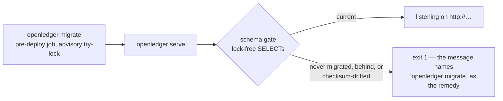

# The service, built and running

**One binary, `openledger`, with three subcommands and one endpoint.** `openledger migrate` applies
the schema the [database page](/database) explains, and exits. `openledger serve` refuses to start
against a database that schema never reached, then answers `POST /v1/transactions`: post a balanced
transaction, or replay the stored answer for an idempotency key it has already seen.
`openledger reconcile` runs the schema's ten reconciliation checks in one snapshot and turns them
into an exit code — the daily sweep as a command. The rest of
this page walks that code — the startup gate, the write path and what it guarantees, the wire
contract, the crate boundaries that enforce the design, what the e2e suite proves, and
[what is not built yet](#still-open--what-is-not-there).

The census, counted 2026-08-28 against the workspace: **6 crates · 3 subcommands · 1 endpoint ·
4 exit codes · 38 end-to-end tests · 10 reconciliation checks asserted at zero after every
endpoint test.**

The API itself is browsable as rendered documentation: **[the API reference](/api-reference/)**,
generated on every site build from the committed `crates/api/openapi.json` — never a second
hand-maintained copy.

## The shape: one binary, three commands, one refusal

[ADR-0003](/decisions/0003-migrations) split deployment in two — migrations are a pre-deploy job,
and **the ledger process never migrates** — and made both halves the *same image*: `migrate` is a
subcommand of the serving binary, so a deployment runs one artifact with two commands. The third
piece is what closes the gap that split opens — a `serve` rolled out against a database its migrate
job never reached:



**`migrate`** (`crates/db/src/migrate.rs`) applies what is pending and exits. Two things are not
the migration library's defaults, both ADR-0003's: sqlx's own *blocking* advisory lock is off —
a blocked migrator is a live transaction that deadlocks with a concurrent
`CREATE INDEX CONCURRENTLY`, so ours is a **try-lock in a poll**, asking once a second and sleeping
outside any transaction — and **no down migrations exist**, held by a test rather than a sentence
(`sqlx::migrate!` would compile a `.down.sql` in without comment). When the lock times out, the
failure message queries `pg_locks` and names the pid holding it.

**`serve`** (`crates/openledger/src/main.rs`) is the composition root: the one place the Postgres
repository is wired into the writer service, and the service into the API router as its `Ledger`
port. Before it binds, the schema gate
(`crates/db/src/verify.rs`) refuses an unmigrated database, one behind the binary, and one whose
**applied checksum differs** from the baseline this binary embeds — the pre-freeze-era database
that would otherwise pass on version number alone and then fail request by request — and the check
is **lock-free on purpose, not as an optimization**: it runs plain `SELECT`s against sqlx's own
`_sqlx_migrations` table, comparing versions *and checksums* against what the binary carries, so a
starting server never blocks a migrator and a migrator never blocks a starting server. A database
*ahead* of the binary passes — the tolerance a rolling restart needs, stated in the gate's own doc.
ADR-0003's split is what makes a lock-free read sufficient. The refusal is exit 1 with the remedy
in the message: *"Run `openledger migrate` first — the serving process never migrates."*

**`reconcile`** (`crates/db/src/reconcile.rs`) is the daily sweep as a command, the shape
[ADR-0010](/decisions/0010-reconciliation) decided for it: something an operator runs and
schedules, never a step that happens invisibly. It reads
`SELECT check_name, breaks FROM reconciliation` — the ten checks the schema ships — in **one
`REPEATABLE READ READ ONLY` transaction**, because the family of views is many statements and one
snapshot is what keeps the summary and the break lists describing the same book; the transaction
writes nothing and takes `ACCESS SHARE` only, so it cannot block a posting. It runs **as
`openledger_recon`**, the role the views grant to and the one that cannot write the cache it
checks; the role is `NOLOGIN` (the baseline names roles for what they may do, never for who logs
in), so the command assumes it with `SET ROLE` and the login behind `DATABASE_URL` needs only
membership. Ten checks at zero breaks is exit 0 and one summary line; anything else is exit 1 with
every breaking check named on stderr — and a summary returning fewer than ten rows is *also* a
failure, because a check that never ran is indistinguishable from one that passed, and this
project has already paid for reading that silence as assent (ADR-0010).

**The exit codes are an operator contract**, defined once (`crates/openledger/src/failure.rs`) and
printed under `--help`: **0** nothing left to do, or every reconciliation check clean, **1** it
failed or the sweep found breaks — read the error before retrying, **2** the invocation is wrong —
retrying changes nothing, **3** another migrator held the lock for the whole budget — safe to
re-run. The distinction exists so a deploy pipeline can retry exit 3 blindly and must not retry
exit 1 blindly. Drift shares exit 1 deliberately: ADR-0010 assigns the sweep no code of its own,
and a drifted book is exactly "read the error first" — the message, not the number, is where a
failed sweep and a red one differ.

## The write path, as implemented

The database page ends where the writer begins: ADR-0013 specified this path before it existed,
and this is the path as it now runs — `crates/api` (the handler), `crates/ledger` (the writer
service and the pure math before the SQL), `crates/ledger/postgres` (the SQL, a nested
workspace member). One database transaction; the event claim and everything it causes commit
together — and since 2026-08-28 the whole append is **one server-side statement** (roadmap M3's
single-call posting): a posting costs **three round trips** — the explicit `BEGIN`, the statement,
`COMMIT` — where the lean writer of 2026-08-27 spent **eight** on the same two-account posting
(`BEGIN`, `SET`, claim, transaction, one balance upsert per account, entries, `COMMIT`; counted
from the adapter, one statement per repository method). [Spike
003](/spikes/003-throughput-ceiling) is the motivation: collapsing the per-clearing round trips
into one call measured ~14% on localhost, where a round trip costs ~0.05 ms — and the same five
saved round trips are ~2.5 ms against ~1.3 ms of real work at RDS-like latency, which is the
number that made this a design constraint rather than a tuning knob.

```mermaid
sequenceDiagram
    participant C as caller
    participant H as api handler
    participant W as the writer service (ledger)
    participant P as PostgreSQL

    C->>H: POST /v1/transactions
    Note over H: construct the command — an unbalanced<br/>body is unconstructible (ADR-0005)
    H->>W: post(command)
    Note over W: canonical bytes → SHA-256 idempotency hash (ADR-0013);<br/>expand postings to legs, coalesce per (account, currency)<br/>in account-id order, count each leg's offset<br/>back from its account's counter
    W->>P: BEGIN ISOLATION LEVEL READ COMMITTED
    W->>P: statement A, carrying the whole append — one CTE pipeline:<br/>claim the key (INSERT event … ON CONFLICT DO NOTHING),<br/>and from the claimed row: the transaction, the balance<br/>upserts in account order RETURNING last_seq, the entries<br/>numbered last_seq − offset through one unnest
    alt rows back — this caller is the first writer, the append already ran
        W->>P: COMMIT
        H-->>C: 201 · Idempotency-Replayed: false
    else zero rows — the key already exists, none of the append ran
        W->>P: statement B — the stored result,<br/>hash in the WHERE
        W->>P: ROLLBACK
        H-->>C: 200 · Idempotency-Replayed: true — or 422
    end
```

Step by step, with the reasoning each one carries:

1. **Validation is a shape, not a check** ([ADR-0005](/decisions/0005-event-log-and-write-path)).
   The handler deserializes into `Posting`, whose only constructor takes a source, a destination
   and a positive amount — one dangling leg is not *expressible*, so debits-equal-credits is
   enforced by the type system before any SQL runs. What `new` refuses (a non-positive amount, a
   malformed currency, a self-transfer, a blank tenant) is a 422 that never reaches the database —
   the e2e suite asserts the row counts did not move.
2. **The canonical hash** (`crates/ledger/src/domain.rs`). The idempotency hash is SHA-256 over a
   versioned, length-prefixed byte form that names no fields — ADR-0013's closing warning is that
   Formance hashes its JSON encoding, which couples every stored hash to field names. Timestamps
   are normalized to UTC first, so a client that re-renders `12:00+02:00` as `10:00Z` is a replay,
   not a poisoned key.
3. **The writer SETS `READ COMMITTED`, never inherits it**
   ([ADR-0013 §1](/decisions/0013-write-path-contract)) — now literally the ADR's own sentence:
   the transaction opens with `BEGIN ISOLATION LEVEL READ COMMITTED`, one round trip, no second
   `SET` statement. Measured there: under a deployment default of `REPEATABLE READ`, contended
   writes fail with `could not serialize access` at 64–82%, and an in-transaction retry rescues
   **0 of 25,074** — so the isolation level is the writer's to state.
4. **The replay is still two statements** ([ADR-0013 §2](/decisions/0013-write-path-contract)),
   and single-call posting rides the append on the CLAIM, never on the lookup. Statement A claims
   the key, and every dependent insert in its CTE pipeline selects `FROM` the claimed row — so
   when the key is already held, zero rows come back and *none of the append ran*. Then a
   *separate* statement B takes a new snapshot — folding B into A is the one-statement form that
   returns zero rows under exactly the race it exists to handle, which is why it stays out. B
   carries the body hash **in the `WHERE`, not as a returned column**: a same-key/different-body
   call gets no row, so a caller that forgets to compare gets nothing instead of the wrong stored
   result.
5. **Coalesce, then lock in account order** ([spike 003](/spikes/003-throughput-ceiling)). Legs are
   summed per (account, currency) so N legs cost one balance upsert, and the coalesced map is a
   `BTreeMap` so the deltas arrive in account-id order — inside the statement, the `ORDER BY` on
   the `SELECT` feeding the upsert is what holds that order batch-wide when the row locks are
   taken; the spike measured the unordered alternative collapsing 10× into deadlocks. The upsert's
   row lock *is* the serialization point (the database page's `ledger_account_balances` section is
   the long version), and its `INSERT` arm selects the account's frozen identity columns from
   `ledger_accounts` itself — which doubles as the existence check: an unknown account or a wrong
   currency joins to nothing and comes back as a `NULL` counter, and the writer rolls back with
   `unknown_account`.
6. **Sequence numbers walk back from the totals.** The domain counts each leg's offset back from
   its account's counter (`offsets_back_from_last_seq`, crate-internal to `ledger` — the pure half
   of the walk-back), and the statement numbers each entry `last_seq − offset` beside the counter
   the upsert just returned — gapless per-account numbering with no second lock and no
   `SELECT max()`.
7. **Entries land through one `unnest`** — measured within 2% of `COPY` on this table at every
   batch size tried, the composite foreign keys dominating
   ([ADR-0013 §5](/decisions/0013-write-path-contract)) — inside the same statement as everything
   they depend on.

## The contract on the wire

What a caller sees, framed the way [ADR-0013 §2](/decisions/0013-write-path-contract) frames it —
by **what the caller must do next**, which is the IETF idempotency draft's split and the reason the
refusals are 422 rather than 400 or 409:

| response | meaning | what the caller does |
| --- | --- | --- |
| **201** + `Idempotency-Replayed: false` | This call claimed the key and wrote the transaction atomically | Nothing — done |
| **200** + `Idempotency-Replayed: true` | This key was already accepted with this same body; the stored `(event_id, transaction_id)` is **re-rendered, never a cached response body** | Nothing — done; treat it as the same success |
| **422** `invalid_request` | A precondition on the body failed (unbalanced is unconstructible, so this is a malformed leg, currency, date or overflow) — nothing was written | Fix the body |
| **422** `idempotency_key_reused` | Same key, different body — nothing was written | Send a new key, or resend the original request unchanged |
| **422** `unknown_account` | A posting names an account that does not exist or does not hold that currency — nothing was written | Fix the account or currency |
| **500** `internal` | The write failed; nothing was committed. The caller gets no internals; the operator's log has the error | Retry is safe — the key makes it harmless |

Two things are deliberately absent. There is **no 409**: a concurrent duplicate blocks on the key
claim and finds a durable result, so there is no in-flight state to name. And `transaction_id` is
**nullable by contract** even though this endpoint always writes one — most accepted operations
write no transaction at all ([ADR-0005](/decisions/0005-event-log-and-write-path)), and a replay
re-renders whatever was stored.

The full rendered contract — schemas, examples, the header on both success responses — is
**[the API reference](/api-reference/)**. Its source is `crates/api/openapi.json`, generated from
the `utoipa` annotations beside the handler and held by a byte-diff snapshot test
(`make openapi-check`); regenerating it is an explicit opt-in (`make openapi`), so a normal test
run can only ever *fail* on drift, never paper over it.
[Spike 017](/spikes/017-openapi-tooling) chose `utoipa`, and
[ADR-0014](/decisions/0014-http-api) refused `utoipa-axum` on the spike's own finding (19 stale
months, RUSTSEC-2024-0436 via `paste`) — which leaves the route string in the annotation and the
route string in the router as two strings nothing structural compares, so the e2e conformance test
compares them instead (below).

## The crate map, and what holds the boundaries

Six crates, split along the hexagon's seams
([0015](/decisions/0015-workspace-enforcement)):

| crate | job | may speak (deny.toml) |
| --- | --- | --- |
| `ledger` | The domain, the ports and the writer service: posting types, validation, the canonical hash, the pure posting math, and the orchestration behind the `Ledger` port | — **sqlx is forbidden here**, and that is the boundary |
| `ledger-postgres` | The adapter, a nested member at `crates/ledger/postgres`: the `Repository` port's Postgres implementation; all of its SQL in one repository file | `sqlx` |
| `db` | The pool, `migrate`, `reconcile`, the schema gate | `sqlx` |
| `api` | The HTTP surface and the OpenAPI annotations | `axum`, `utoipa` |
| `openledger` | The binary: parse, dispatch, exit codes, and the composition root | `clap` |
| `e2e` | The end-to-end suite and its instrumentation | `sqlx`, `reqwest`, `testcontainers` |

Three mechanisms make the table a ratchet rather than a diagram:

- **deny.toml's capability map.** Each capability crate (`sqlx`, `axum`, `utoipa`, `clap`,
  `reqwest`, `testcontainers`) lists the *only* workspace crates allowed to depend on it; any other
  crate reaching for one fails `cargo deny check` on every push. The `ledger` crate's absence from
  sqlx's list is the hexagonal boundary made machine-checked — the domain compiles with no
  database in the room, which is what makes "an unbalanced transaction is unconstructible" a claim
  a unit test can hold without Postgres.
- **The clock lint.** `clippy.toml` disallows `SystemTime::now` and `Instant::now`
  workspace-wide: a ledger's two clocks are `recorded_at` (the database's) and `effective_at` (the
  caller's) ([ADR-0006](/decisions/0006-time-and-as-of)), and nothing gets to invent a third
  ambiently. The one legitimate use — the migrator's operator-facing wait budget and elapsed-ms
  log line — carries `#[expect]` with its reason at the call site.
- **No panics.** The workspace denies `unwrap`, `expect` and `panic` in production code
  ([ADR-0001](/decisions/0001-rust-and-postgres)); the binary builds its runtime by hand so even a
  failed runtime start is a message and an exit code, and both `say()` helpers exist because
  `println!` panics on a broken pipe.

## What the e2e suite proves, and how

`crates/e2e` is the suite that earns the word *end-to-end*: it spawns **the compiled `openledger`
binary as a process** — resolved from `target/`, never rebuilt or mocked — and speaks to it over
real HTTP, against a real PostgreSQL that the binary itself migrated. Per test:

1. A **scratch database** `e2e_<name>` is dropped and recreated, so no test reads another's state.
2. `openledger migrate` runs against it — the adopter's own first command, exercised on every
   book the suite builds rather than assumed.
3. The published chart (`schema/chart.sql`) is seeded, `serve` binds port 0, and the test reads the
   real address from the binary's announced `listening on http://…` line — the first line of stdout
   is a contract, not a log.
4. After the test's own assertions, **the oracle**: `SELECT * FROM reconciliation` — the ten
   reconciliation checks the schema ships ([ADR-0010](/decisions/0010-reconciliation)) — asserted
   at **ten zeros** as the last line of every endpoint and role test. A write path bug that keeps the
   HTTP response plausible still has to keep all ten comparisons clean to get out of the suite.

Where the PostgreSQL comes from: `DATABASE_URL` when set — `make test` and CI point it at a
database they run — and otherwise **one `postgres:18-alpine` testcontainer** shared by the whole
binary, named `openledger-e2e-pg` and reused across runs (testcontainers 0.27 ships no reaper, so
an anonymous container would leak one per run; a named, reused one caps the population at exactly
one).

The thirty-eight tests, by what each holds:

- **Nine endpoint tests** (`endpoints/transactions/post.rs`) — the whole `POST /v1/transactions`
  contract in one file: a posting lands on both accounts' balance rows; two postings over one pair
  coalesce with gapless seqs; an unknown account — or a currency the account does not hold — is
  refused *and the three write tables did not move*; an invalid body never reaches the database; a
  replay returns 200, the stored ids and the header; a reused key with a different body is refused;
  **twelve concurrent identical posts produce exactly one write** and eleven replays, never a 409
  ([ADR-0013](/decisions/0013-write-path-contract) §2's race, held against the one-statement
  refactor it forbids); a storage failure is a 500 that commits nothing and names no internals; and
  a second tenant reusing the first's idempotency key gets its own fresh write.
- **Conformance** (`conformance.rs`) — the committed `openapi.json` against the running router:
  every documented (path, method) must answer neither 404 nor 405 on the wire, an undocumented
  method on the same path must answer exactly 405, and the spec's path set must *equal* the
  route table the router is built from, so a route the spec forgot fails as loudly as a route the
  router lost. This is the working replacement for the structural guarantee the refused
  `utoipa-axum` would have given.
- **Three startup tests** (`startup.rs`) — `serve` refuses, at exit 1 and naming
  `openledger migrate`, a database that was never migrated, one behind this binary (naming the
  missing version), and one whose applied checksum differs from the embedded baseline — all three
  branches of the schema gate.
- **Two role tests** (`roles.rs`) — the full happy path with `serve` running as a login role
  inheriting `openledger_app`, proving the baseline's GRANT lists carry the writer as a
  policy-admitted role rather than the table owner; and a scoped `openledger_read` login that sees
  exactly one tenant with `app.tenant_id` set and **zero rows with it unset** — the fence fails
  closed ([ADR-0013](/decisions/0013-write-path-contract) §5).
- **Two exit-code tests** (`exit_codes.rs`) — a malformed `--bind` is a usage error at exit 2, and
  a migrator that never gets the advisory lock exits 3 telling the operator it is safe to re-run —
  the two halves of the failure contract that exist to be retried differently.
- **Twenty-one reconcile tests** (`reconcile.rs`) — the sweep subcommand, spawned as a process
  like everything else here, with a red-path injection for **every one of the summary's ten
  checks**: a check that cannot fail this suite through the command is a safety net nobody has
  load-tested. Two controls at exit 0: a clean, non-empty book (which also pins the suite's own
  copy of the ten check names against the live view), and a correctly-booked **pending**
  transaction — the population that must be *named* (the bridge derives available = posted +
  pending) and never read as a break. [Spike 011](/spikes/011-reconciliation)'s five drift
  classes, each at exit 1 with the right check — and only it — named on stderr: a forged cache
  (`balance_cache`), a forged sequence counter with the balance exact (same check, the `seq_ahead`
  class — ADR-0004's 48-wide gap), an entry with no transaction via the replica-role path
  (`orphan_entries`, kept a named reconciling item rather than an unexplained gap), an entryless
  transaction — the ADR-0004 `TRUNCATE` scar (`unbalanced_transactions`), and a one-sided
  cross-scope booking posted through the front door (`cross_scope_mirror`, grouped per
  counterparty). The four checks that joined the family after the spike, same contract: a
  fat-fingered year-2226 posting lands in the out-of-window bucket (`journal_to_reports`), a
  single posted leg breaks the face and the rows together (`accounting_equation` +
  `unbalanced_transactions` — the one injection that cannot break alone, and says so), a close
  whose stored cursor precedes its own closing transaction (`close_typing`), a close whose
  checkpoint rows never landed (`checkpoint_drift`, one `missing_row` per account), an entry
  whose supplied commit key predates its transaction (`cursor_forgery`'s persistent class — the
  one no horizon wait retires), and an `is_perimeter` account posted to and never attested
  (`chart_lint`). Two simultaneous drifts are both named in one sweep. The contract edges: no URL
  and a garbage URL at exit 2, an unreachable database at exit 1, a login outside
  `openledger_recon` refused with the `GRANT` to run, a summary surgically shortened to nine
  checks **failing rather than passing** — nine zeros are silence, not assent — and a write
  smuggled into the summary's read path as `SECURITY DEFINER` refused by the sweep's READ ONLY
  transaction itself, with nothing landed. And sweeps raced against a live wave of API posts: at
  worst the documented horizon transient, never any other check, and the quiesced book sweeps
  clean — [ADR-0010](/decisions/0010-reconciliation)'s command contract, with its negative
  controls.

## STILL OPEN — what is not there

Stated the way the database page states its gaps: each of these is a hole today, not a design.

> **STILL OPEN — no authentication.** The tenant is named in the request body, and the trust story
> is the deployment perimeter's until an auth decision exists. Nothing about the write path assumed
> otherwise — but nothing enforces a caller's claim to a tenant either.

> **STILL OPEN — the writer is the lean single-stripe one.** Every write touches stripe 0 only:
> the schema's balance striping ([ADR-0013 §4](/decisions/0013-write-path-contract)) is applied
> but no selection policy is built, and the throughput numbers on this site are the spikes'
> measurements of the SQL shape, not a load test of *this* binary — batching under load has no
> proof yet. Pending→posted resolution (`resolves_id` is in the schema) has no endpoint.

> **STILL OPEN — one endpoint.** There is no read over HTTP: balances, entries and reports are
> reachable only through SQL and the report functions the schema ships. The write path came first
> because it is the half that can corrupt.

The unbuilt work these imply is on the [roadmap](/roadmap).
